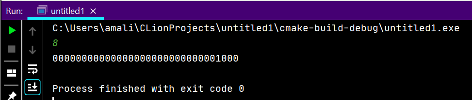
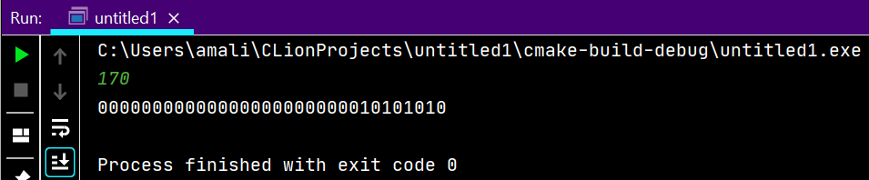
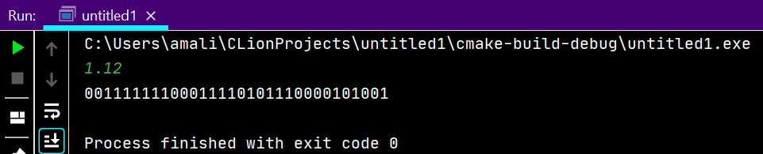
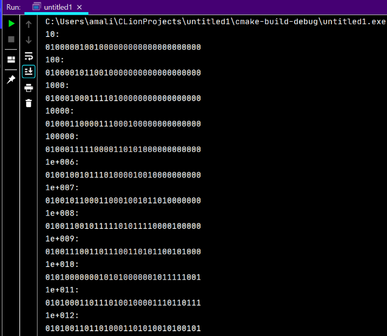
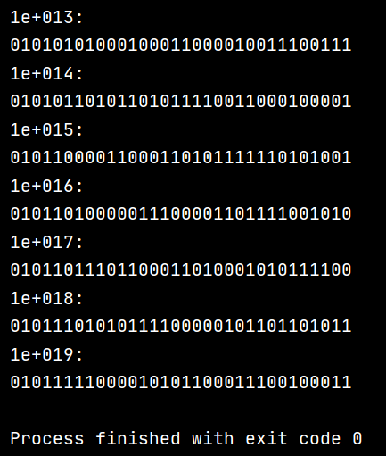
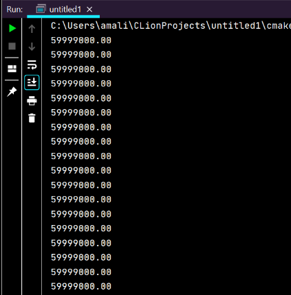
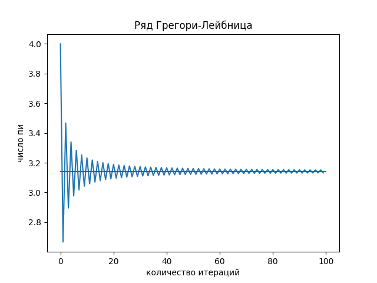
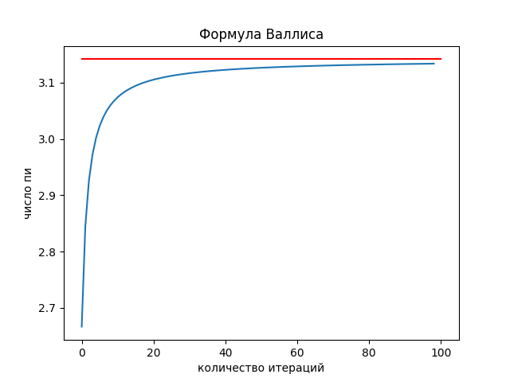
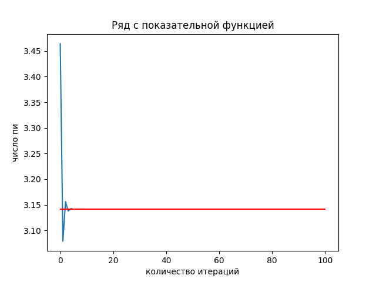
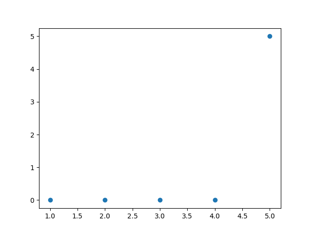

### 0. unsigned int -> binary
```C++
#include <bits/stdc++.h>

void unsignedint_to_bin(unsigned int n) {
    for (int i = 8 * sizeof(unsigned int) - 1; i >= 0; i--) {
        unsigned int digit = ((n & (1 << i)) >> i);
        std::cout << digit;
    }
    std::cout << "\n";
}

int main() {
  unsigned int n;
  std::cin >> n;
  unsignedint_to_bin(n);
}
```


### 1. float -> binary
```C++
#include <bits/stdc++.h>

void unsignedint_to_bin(unsigned int n) {
    for (int i = 8 * sizeof(unsigned int) - 1; i >= 0; i--) {
        unsigned int digit = ((n & (1 << i)) >> i);
        std::cout << digit;
    }
    std::cout << "\n";
}

union uni {
    float f;
    unsigned int u;
};

int main() {
    uni x;
    std::cin >> x.f;
    unsignedint_to_bin(x.u);
}
```

### 2. Переплонение мантиссы
```C++
#include <bits/stdc++.h>

void unsignedint_to_bin(unsigned int n) {
    for (int i = 8 * sizeof(unsigned int) - 1; i >= 0; i--) {
        unsigned int digit = ((n & (1 << i)) >> i);
        std::cout << digit;
    }
    std::cout << "\n";
}

union uni {
    float f;
    unsigned int u;
};

int main() {
    uni x;
    for (float i = 10.; i < 1e20; i *= 10.) {
        x.f = i;
        std::cout << i << ':' << '\n';
        unsignedint_to_bin(x.u);
    }
}
```


### 3. Бесконечный цикл
```C++
#include <bits/stdc++.h>

int main() {
    std::cout << std::fixed;
    std::cout.precision(2);
    for (float i = 6e7 - 1e3; i < 6.e7 + 1e3; i += 1.) {
        std::cout << i << '\n';
    }
}
```

### 4. График pi
```C++
#include <bits/stdc++.h>
#include <fstream>

int main() {
    std::ofstream f1("1.csv", std::ios::out);
    std::ofstream f2("2.csv", std::ios::out);
    std::ofstream f3("3.csv", std::ios::out);
    std::ofstream f4("4.csv", std::ios::out);

    double p1 = .0;
    for (int i = 0; i < 100; i++) {
        p1 += 4. * pow(-1, i) / (2. * i + 1.);
        f1 << p1 << '\n';
    }
    double p2 = 1.;
    for (int i = 1; i < 100; i++) {
        p2 *= ((4.0 * i * i) / (4.0 * i * i - 1.0));
        f2 << 2 * p2 << '\n';
    }
    for (long long int n = 1; n <= 10; n++) {
        float p3 = 0.;
        float x = 1.;
        for (int i = 1; i <= n; i++) {
            p3 += x / (pow(3, i - 1) * (2 * (i - 1) + 1));
            x *= -1.0;
        }
        f3 << 2 * sqrt(3) * p3 << '\n';
    }
    double p4 = .0;
    for (int i = 0; i < 100; i++) {
        p4 += 1 / pow(16., i) * (4. / (8 * i + 1) - 2. / (8 * i + 4) - 1. / (8 * i + 5) - 1. / (8 * i + 6));
        f4 << p4 << '\n';

    }
}
```
```python
import matplotlib.pyplot as plt
import numpy
import math

x_pi = numpy.linspace(0, 100, 10)
y_pi = [math.pi] * 10

f1 = [float(i.strip()) for i in
      open('C:\\Users\\amali\\CLionProjects\\untitled1\\cmake-build-debug\\1.csv', 'r').readlines()]
x1 = [i for i in range(0, len(f1))]
fig1, ax1 = plt.subplots()
ax1.plot(x1, f1)
ax1.plot(x_pi, y_pi, color="red")
plt.title('Ряд Грегори-Лейбница')
plt.xlabel('количество итераций')
plt.ylabel('число пи')
f2 = [float(i.strip()) for i in
      open('C:\\Users\\amali\\CLionProjects\\untitled1\\cmake-build-debug\\2.csv', 'r').readlines()]
x2 = [i for i in range(0, len(f2))]
fig2, ax2 = plt.subplots()
ax2.plot(x2, f2)
ax2.plot(x_pi, y_pi, color="red")
plt.title('Формула Валлиса')
plt.xlabel('количество итераций')
plt.ylabel('число пи')

f3 = [float(i.strip()) for i in
      open('C:\\Users\\amali\\CLionProjects\\untitled1\\cmake-build-debug\\3.csv', 'r').readlines()]
x3 = [i for i in range(0, len(f3))]
fig3, ax3 = plt.subplots()
ax3.plot(x3, f3)
ax3.plot(x_pi, y_pi, color="red")
plt.title('Ряд с показательной функцией')
plt.xlabel('количество итераций')
plt.ylabel('число пи')

f4 = [float(i.strip()) for i in
      open('C:\\Users\\amali\\CLionProjects\\untitled1\\cmake-build-debug\\4.csv', 'r').readlines()]
x4 = [i for i in range(0, len(f4))]
fig4, ax4 = plt.subplots()
ax4.plot(x4, f4)
ax4.plot(x_pi, y_pi, color="red")
plt.title('Формула Бэйли—Боруэйна—Плаффа')
plt.xlabel('количество итераций')
plt.ylabel('число пи')
plt.show()
```
Формула Лейбница:



Формула Валлиса:



Формула через показательную функцию:



Формула Бэйли—Боруэйна—Плаффа:


### 5. Время pi
```C++
#include <bits/stdc++.h>
#include <fstream>

unsigned long long fact(unsigned int n) {
    if (n < 2) return 1;
    return n * fact(n - 1);
}

int main() {
    std::cout << std::fixed;
    std::cout.precision(10);

    double pi = 3.1415926535;
    double pi_vallis = 1.;
    float pi_leib = 0.;
    float pi_sq_1 = 0.;
    float pi_sq_2 = 0.;
    float one = 1.;
    unsigned int counter_v = 1, counter_l = 1, counter_1 = 1, counter_2 = 1, n = 1;
    std::ofstream f_vallis("time_1.txt");
    std::ofstream f_leib("time_2.txt");
    std::ofstream f_sq_1("time_3.txt");
    std::ofstream f_sq_2("time_4.txt");
    std::ofstream f_n("time_n.txt");
    auto start1 = clock();
    for (long i = 1; i < 1000000000; i += 1) {
        pi_vallis *= ((4.0 * i * i) / (4.0 * i * i - 1.0));
        one *= -1.0;
        auto now1 = clock();
        if (floor(pi_vallis * 2 * pow(10, counter_v)) == floor(pi * pow(10, counter_v))) {
            std::cout << counter_v;
            f_vallis << now1 - start1 << '\n';
            f_n << counter_v << '\n';
            counter_v++;
        }

        if (counter_v == 6)
            break;
    }
}
```
```python
import matplotlib.pyplot as plt

pi_1 = [float(i.strip()) for i in
        open('C:\\Users\\amali\\CLionProjects\\untitled1\\cmake-build-debug\\1.csv', 'r').readlines()]
pi_2 = [float(i.strip()) for i in
        open('C:\\Users\\amali\\CLionProjects\\untitled1\\cmake-build-debug\\2.csv', 'r').readlines()]
pi_3 = [float(i.strip()) for i in
        open('C:\\Users\\amali\\CLionProjects\\untitled1\\cmake-build-debug\\3.csv', 'r').readlines()]
pi_4 = [float(i.strip()) for i in
        open('C:\\Users\\amali\\CLionProjects\\untitled1\\cmake-build-debug\\4.csv', 'r').readlines()]

n1 = [float(i.strip()) for i in
      open('C:\\Users\\amali\\CLionProjects\\untitled1\\cmake-build-debug\\time_n.txt', 'r').readlines()]
t_1 = [float(i.strip()) for i in
       open('C:\\Users\\amali\\CLionProjects\\untitled1\\cmake-build-debug\\time_1.txt', 'r').readlines()]
t_2 = [float(i.strip()) for i in
       open('C:\\Users\\amali\\CLionProjects\\untitled1\\cmake-build-debug\\time_2.txt', 'r').readlines()]
t_3 = [float(i.strip()) for i in
       open('C:\\Users\\amali\\CLionProjects\\untitled1\\cmake-build-debug\\time_3.txt', 'r').readlines()]
t_4 = [float(i.strip()) for i in
       open('C:\\Users\\amali\\CLionProjects\\untitled1\\cmake-build-debug\\time_4.txt', 'r').readlines()]

plt.scatter(n1, t_1)
plt.scatter(n1, t_2, marker='x', color='red')
plt.scatter(n1, t_3, marker='o', color='green')
plt.scatter(n1, t_4, marker='v', color='black')

plt.xlabel('номер знака после запятой')
plt.ylabel('время достижения значения числа пи')
plt.show()
```

