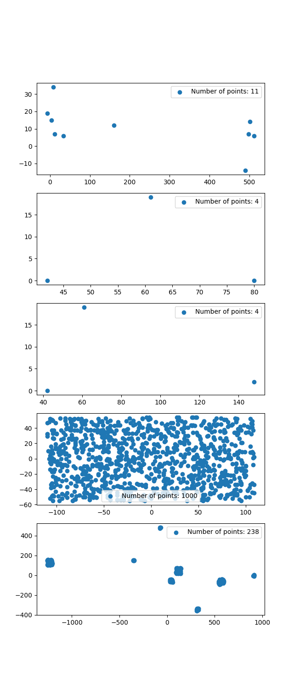
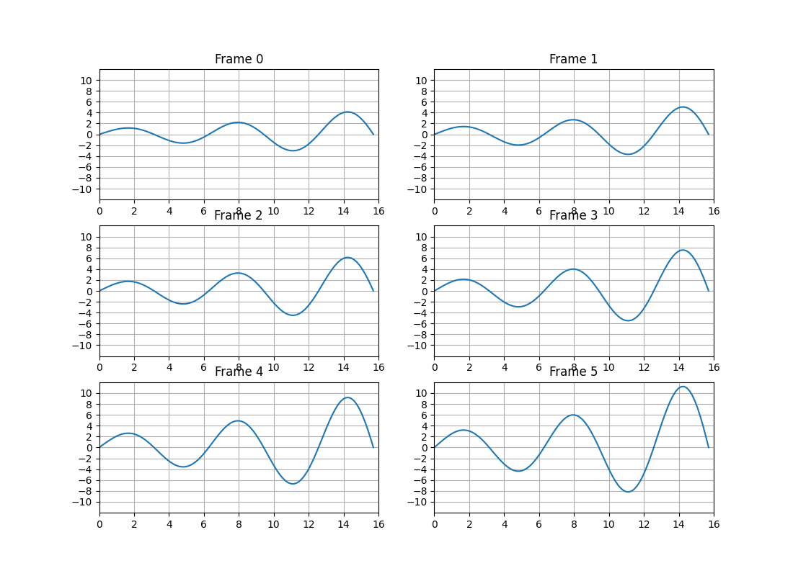
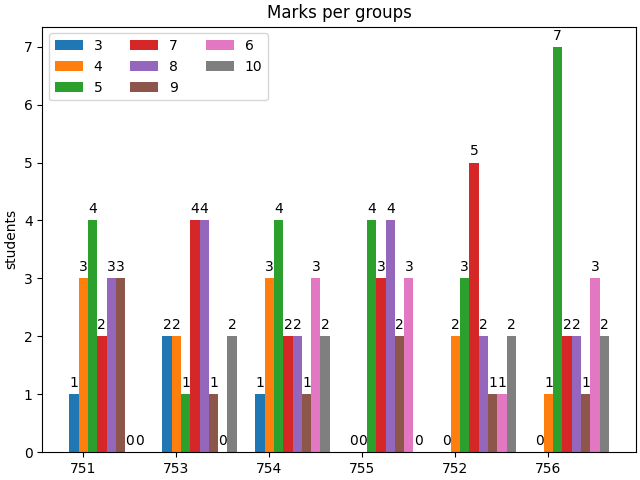

### 1. Dead Мороз
Считываем данные из файлов:
```Python
dm1 = [i.strip() for i in open('dead_moroz/001.dat').readlines()]
n1 = int(dm1[0])
dm2 = [i.strip() for i in open('dead_moroz/002.dat').readlines()]
n2 = int(dm2[0])
dm3 = [i.strip() for i in open('dead_moroz/003.dat').readlines()]
n3 = int(dm3[0])
dm4 = [i.strip() for i in open('dead_moroz/004.dat').readlines()]
n4 = int(dm4[0])
dm5 = [i.strip() for i in open('dead_moroz/005.dat').readlines()]
n5 = int(dm5[0])
```

Строим точки с помощью `scatter`:
```Python
fig1, axs1 = plt.subplots(nrows=5, ncols=1)
fig1.set_figheight(15)
axs1[0].scatter([float(i.split()[0]) for i in dm1[1:n1]], [float(i.split()[1]) for i in dm1[1:n1]],
                label='Number of points: ' + str(n1))
axs1[0].legend()
axs1[0].set_aspect('equal', adjustable='box')
axs1[1].scatter([float(i.split()[0]) for i in dm2[1:n2]], [float(i.split()[1]) for i in dm2[1:n2]],
                label='Number of points: ' + str(n2))
axs1[1].legend()
axs1[1].set_aspect('equal', adjustable='box')
axs1[2].scatter([float(i.split()[0]) for i in dm3[1:n3]], [float(i.split()[1]) for i in dm3[1:n3]],
                label='Number of points: ' + str(n3))
axs1[2].legend()
axs1[2].set_aspect('equal', adjustable='box')
axs1[3].scatter([float(i.split()[0]) for i in dm4[1:n4]], [float(i.split()[1]) for i in dm4[1:n4]],
                label='Number of points: ' + str(n4))
axs1[3].legend()
axs1[3].set_aspect('equal', adjustable='box')
axs1[4].scatter([float(i.split()[0]) for i in dm5[1:n5]], [float(i.split()[1]) for i in dm5[1:n5]],
                label='Number of points: ' + str(n5))
axs1[4].legend()
axs1[4].set_aspect('equal', adjustable='box')
plt.show()
```

Получаем такие графики:




### 2. Эволюция некоторого процесса
Считываем данные и визуализируем из последовательно
```Python
frames = open('frames.dat.txt').readlines()
fig2, axs2 = plt.subplots(nrows=len(frames) // 4, ncols=2)
fig2.set_figheight(7)
fig2.set_figwidth(11)
num_g = 0
for i in range(0, len(frames), 2):
    x = list(map(float, frames[i].split()))
    y = list(map(float, frames[i + 1].split()))
    axs2[i // 4][num_g % 2].plot(x, y)
    axs2[i // 4][num_g % 2].set_xlim(0, 16)
    axs2[i // 4][num_g % 2].set_ylim(-12, 12)
    axs2[i // 4][num_g % 2].set_xticks([2 * j for j in range(9)])
    axs2[i // 4][num_g % 2].set_yticks([j for j in range(-10, 11, 2)])
    axs2[i // 4][num_g % 2].set_title('Frame ' + str(num_g))
    axs2[i // 4][num_g % 2].grid()
    num_g += 1
plt.show()
```

Получаем такие графики:




### 3. Распределение оценок по препам и по группам
Разбиваем данные вначале на один словарь преподов
```Python
stud = open('students.csv').readlines()
preps = dict()
groups = dict()
for s in stud:
    p, g, m = s.split(';')
    if p not in preps.keys():
        preps[p] = [int(m)]
    else:
        preps[p].append(int(m))
    if g not in groups.keys():
        groups[g] = [int(m)]
    else:
        groups[g].append(int(m))
```

Потом на два словаря оценок и групп, где ключи - это количество определенных оценок у определенного препода
```Python
p = preps.keys()
marks_per_prep = dict()
all_marks = [j for j in range(3, 11)]
for prep in p:
    marks = set(preps[prep])
    for mark in marks:
        if mark not in marks_per_prep.keys():
            marks_per_prep[mark] = [preps[prep].count(mark)]
        else:
            marks_per_prep[mark].append(preps[prep].count(mark))
    for mark in all_marks:
        if mark not in marks:
            if mark not in marks_per_prep.keys():
                marks_per_prep[mark] = [0]
            else:
                marks_per_prep[mark].append(0)

g = groups.keys()
marks_per_groups = dict()
for group in g:
    marks = set(groups[group])
    for mark in marks:
        if mark not in marks_per_groups.keys():
            marks_per_groups[mark] = [groups[group].count(mark)]
        else:
            marks_per_groups[mark].append(groups[group].count(mark))
    for mark in all_marks:
        if mark not in marks:
            if mark not in marks_per_groups.keys():
                marks_per_groups[mark] = [0]
            else:
                marks_per_groups[mark].append(0)
```

Теперь строим необхожимые гистограммы
```Python
width = 0.1

x1 = np.arange(len(p))
multi = 0
fig3, ax3 = plt.subplots(layout='constrained')
for attribute, measurement in marks_per_prep.items():
    offset = width * multi
    rects = ax3.bar(x1 + offset, measurement, width, label=attribute)
    ax3.bar_label(rects, padding=3)
    multi += 1
ax3.set_ylabel('students')
ax3.set_title('Marks per preps')
ax3.set_xticks(x1 + width, p)
ax3.legend(loc='upper left', ncols=3)
plt.show()

x2 = np.arange(len(g))
multi = 0
fig4, ax4 = plt.subplots(layout='constrained')
multi = 0
for attribute, measurement in marks_per_groups.items():
    offset = width * multi
    rects = ax4.bar(x2 + offset, measurement, width, label=attribute)
    ax4.bar_label(rects, padding=3)
    multi += 1
ax4.set_ylabel('students')
ax4.set_title('Marks per groups')
ax4.set_xticks(x2 + width, g)
ax4.legend(loc='upper left', ncols=3)
plt.show()
```

Получаем такие гистограммы:



