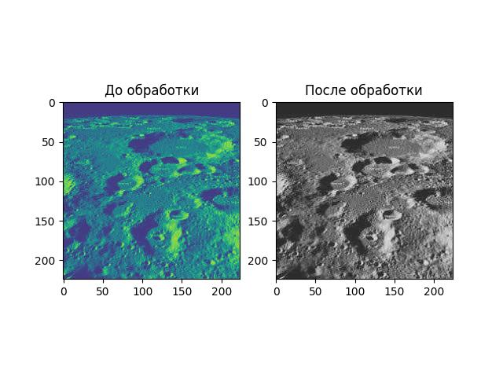
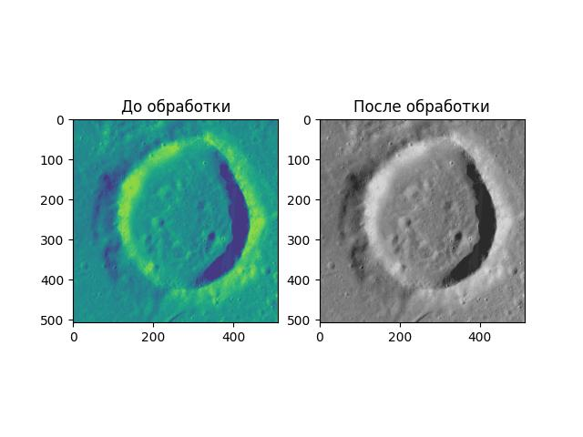
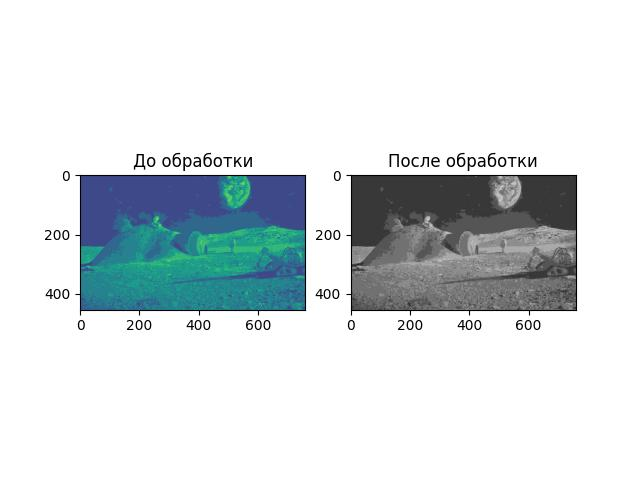
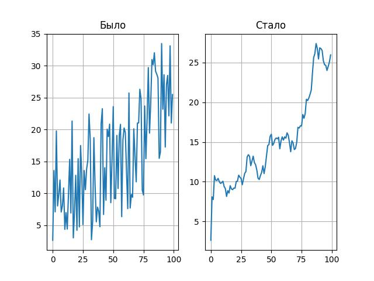
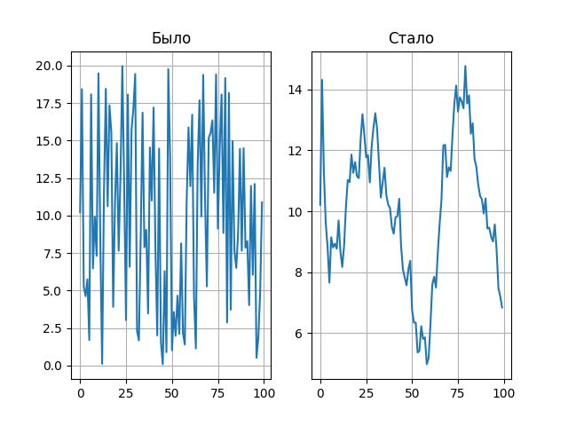
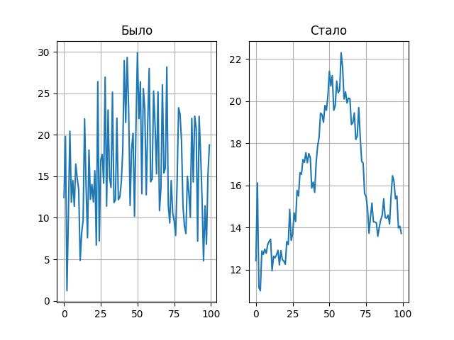
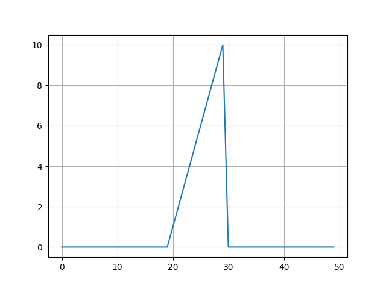
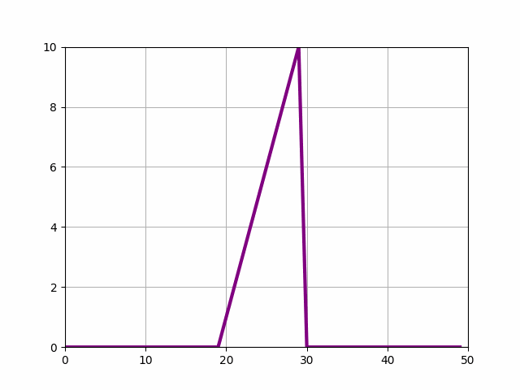

## Эпизод 1
У вас есть картинки поверхности Луны. Они чёрно-белые, и это нормально - такая была камера. К сожалению, качество их не очень - контраст страдает, вместо честных градаций от чёрного до белого камера зафиксировала 42 оттенка серого. Давайте улучшим картинки, чтобы они более внятно воспринимались глазом.

### Задача - переинтерполировать картинки, использовав весь доступный диапазон для улучшения контраста. Логика преобразования такая:

* чёрно-белая картинка - это по сути простой 2D-массив, каждый элемент которого представляет собой 1 пиксель картинки (с цветными всё несколько сложнее),
* каждый пиксель может иметь значения от 0 до 255,
* реально у нас на этих нерезких картинках все пиксели находятся где-то внутри небольшого диапазона значений (условно, от 10 до 50 вместо полного спектра),
* поэтому нужно считать картинку и аккуратно линейно "растянуть" диапазон, минимальное значение на исходной картинки должно получить значение 0 в выходном изображении, а максимальное на исходной - 255 на выходе.

```Python
import os
import numpy as np
from PIL import Image
import matplotlib.pyplot as plt


def func(x, minn, maxx):
    return (x - minn) * 255 / (maxx - minn)


path = 'lunar_images'
os.chdir(path)
for im in os.listdir():
    img = Image.open(im)
    plt.imshow(img)
    data = np.array(img)
    maxx = data.max()
    minn = data.min()
    new_data = []
    for i in range(data.shape[0]):
        ar = []
        for j in range(data.shape[1]):
            ar.append(func(data[i][j], minn, maxx))
        new_data.append(ar)
    res_img = Image.fromarray(np.array(new_data))
    fig, ax = plt.subplots(nrows=1, ncols=2)
    ax[0].imshow(img)
    ax[0].set_title('До обработки')
    ax[1].imshow(res_img)
    ax[1].set_title('После обработки')
    plt.savefig('new_'+str(im))
    plt.show()
```

Получаем такие новые изображения:








## Эпизод 2
У вас есть набор показаний, снятых с датчиков. Предполагается, что вообще-то в данных есть какие-то осмысленные сигналы, по которым можно проследить зависимости. К сожалению, данные очень сильно зашумлены.

К счастью, со случайными шумами можно неплохо бороться, усредняя сигнал по времени. Этим и предстоит заняться.

### Задача - применить к данным фильтр, отрисовать исходные и отфильтрованные данные. Логика фильтра следующая:

будем использовать простое скользящее среднее с шагом 10,
смотреть будем только назад по времени,
стартовые точки сгладим максимально доступным образом.
То есть 0-вое показание остаётся просто собой, 1-ое показание становится средним 0-го и 1-го, 2-ое показание становится средним показаний от 0-го до 2-го и т.д. Показание N становится средним показаний от N-9 до N включительно.

```Python
path_sig = 'signals'
os.chdir(path_sig)
for signal in os.listdir():
    new_sig = []
    sig = [float(i.strip()) for i in open(signal).readlines()]
    print(sig)
    for t in range(10):
        new_sig.append(sum(sig[:t + 1]) / (t + 1))
    for t in range(10, len(sig)):
        new_sig.append(sum(sig[t - 9: t + 1]) / 10)
    fig, ax = plt.subplots(ncols=2, nrows=1)
    ax[0].plot(sig)
    ax[0].grid()
    ax[0].set_title('Было')
    ax[1].plot(new_sig)
    ax[1].grid()
    ax[1].set_title('Стало')
    plt.show()
```








## Эпизод 3.
Некоторый процесс описывается следующим уравнением:

$u(x)^{n+1} = u(x)^n - 0.5 * A * u(x)^n$

В этом уравнении u(x)^n - функция u в момент времени n. Фактически задана формула, как от момента времени n перейти к моменту времени n+1.

Функция задана поточечно. Примерный вид начального состояния:



Матрица A имеет такой вид:

$$\begin{bmatrix}1 & 0 & 0 & ... & 0 & -1 \\
-1 & 1 & 0 & 0 & ... & 0 \\\
0 & -1 & 1 & 0 & ... & 0 \\\
... &  &  &  & \\\
0 & 0 & 0 & ... & -1 & 1\end{bmatrix}$$

То есть на главной диагонали расположены элементы 1, с циклическим сдвигом влево на один элемент от главной диагонали расположены -1, все остальные элементы 0.

Посчитаем и визуализируем 255 шагов по времени этого процесса:
```Python
data = list(map(float, open('start.dat.txt').readlines()))
u0 = np.array(data)
u = []
A = np.diag(np.full(u0.shape, 1))
rows, cols = np.indices(A.shape)
A[rows == cols + 1] = -1
A[0, 49] = -1
u.append(u0)
for i in range(1, 500):
    u.append(u[i - 1] - np.dot(A, u[i - 1]) / 2)
t = np.arange(0, 50)
fig = plt.figure()
axis = plt.axes(xlim=(0, 50), ylim=(0, 10))
line, = axis.plot(t, u[0], lw=3, color='purple')
plt.grid()


def animate(i):
    line.set_data(t, u[i])
    return line,


anim = animation.FuncAnimation(fig, animate, frames=255, interval=200, blit=True)
anim.save('u.gif', writer='pillow')
plt.show()
```


