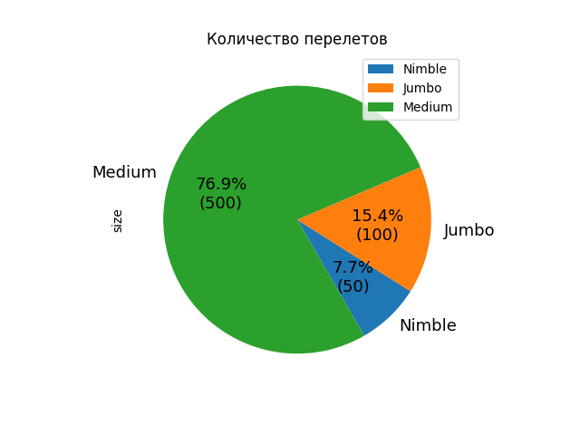
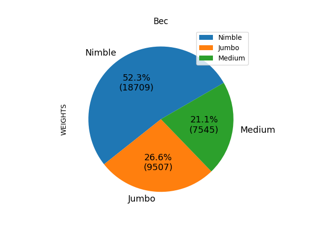
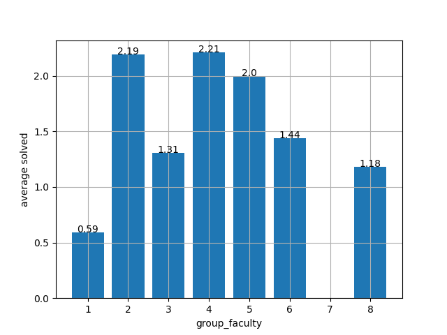

## Эпизод 1
В наши руки попали данные о платежах некоторой глубоко законспирированной организации.
Судя по всему, поля в данных следует воспринимать предельно просто: CONTRACTOR - кому платёж, STATUS - статус операции, SUM - сумма операции. 

### Задача 1: найти 3 самых крупных платежа из реально проведённых (статус OK).
```Python
import pandas as pd

transactions = pd.read_csv('transactions.csv', delimiter=',')
print(transactions[transactions['STATUS'] == 'OK'].sort_values(by='SUM').drop_duplicates('SUM').loc[:, 'SUM'][-3:])
```

Вывод программы(второй столбец соотвествует трём максимальным выплатам):
```
3947       999
4451      1000
5085    100500
```

### Задача 2: определить полную сумму реально проведённых платежей в адрес Umbrella, Inc.
```Python
print(transactions[transactions['STATUS'] == 'OK'][transactions['CONTRACTOR'] == 'Umbrella, Inc']['SUM'].sum())
```

Вывод программы(полная сумма платежей для Umbrella, Inc):
```
925719
```


## Эпизод 2
У нас есть набор данных о грузовых рейсах - вот он. Поля в данных: CARGO - авиакомпания, PRICE - стоимость груза на борту, WEIGHT - масса груза на борту.

### Задача: посчитать, сколько рейсов выполнила каждая авиакомпания, полную стоимость и полную массу перевезённых ей грузов. Построить график уместного вида с результатами.
```Python
import numpy as np

def func(pct, allvals):
    absolute = int(np.round(pct / 100. * np.sum(allvals)))
    return f"{pct:.1f}%\n({absolute:d})"

flights = pd.read_csv('flights.csv', delimiter=',')
data = pd.DataFrame(columns=['SIZE', 'PRICE', 'WEIGHT'])
for cargo in flights['CARGO'].unique():
    siz = flights[flights['CARGO'] == cargo].shape[0]
    price = flights[flights['CARGO'] == cargo].loc[:, 'PRICE'].sum()
    weight = flights[flights['CARGO'] == cargo].loc[:, 'WEIGHT'].sum()
    data._set_value(index=cargo, col='SIZE', value=siz)
    data._set_value(index=cargo, col='PRICE', value=price)
    data._set_value(index=cargo, col='WEIGHT', value=weight)
print(data)
print(data.index)
for yi in ['SIZE', 'PRICE', 'WEIGHT']:
    data.plot.pie(y=yi, labels=data.index, autopct=lambda pct: func(pct, data.loc[:, yi]), startangle=300,
                  fontsize=10, title=yi)
plt.show()
```

Графики:







## Эпизод 3
Однажды один факультет 1-го сентября 1-го курса писал входное тестирование по информатике. В архиве xlsx с данными групп от деканата и html-ная таблица результатов из ejudge. 

В xlsx-файле логины студентов (поле login), номера их факультетских групп (поле group_faculty), номера их групп после распределения на группы по информатике (поле group_out).

### Задание 1: построить графики среднего количества решённых задач (а) по факультетским группам, (б) по группам по информатике
```Python
info = pd.read_excel('students_info.xlsx').dropna()
results = pd.read_html('results_ejudge.html')[0]
info.columns = ['User', 'group_faculty', 'group_out']
data = pd.merge(results, info, on='User')

average_group = []
average_inf = []
for group in data.loc[:, 'group_faculty']:
    a = [group,
         round(data[data['group_faculty'] == group].loc[:, 'Solved'].sum() / data[data['group_faculty'] == group].loc[:,
                                                                             'User'].size, 2)]
    if a not in average_group:
        average_group.append(a)
for group in data.loc[:, 'group_out']:
    a = [group, round(
        data[data['group_out'] == group].loc[:, 'Solved'].sum() / data[data['group_out'] == group].loc[:, 'User'].size,
        2)]
    if a not in average_inf:
        average_inf.append(a)
x1 = [i[0] for i in average_group]
y1 = [i[1] for i in average_group]
plt.bar(x1, y1)
plt.grid()
plt.xlabel('group_faculty')
plt.ylabel('average solved')
for i in range(len(x1)):
    plt.text(x1[i], y1[i], y1[i], ha='center')
plt.savefig('pd3_1.png')
plt.show()
x2 = [i[0] for i in average_inf]
y2 = [i[1] for i in average_inf]
plt.bar(x2, y2)
plt.grid()
plt.xlabel('group_out')
plt.ylabel('average solved')
for i in range(len(x2)):
    plt.text(x2[i], y2[i], y2[i], ha='center')
plt.savefig('pd3_2.png')
plt.show()
```

Полученные графики:




### Задание 2: определить, из каких факультетских групп пришли и в какие группы по информатике попали люди, которые смогли пройти более одного теста в хотя бы одной из двух последних задач.(Задачи G и H в таблице, каждый тест даёт 10 баллов)
```Python
best = data[(data['G'] > 10) | (data['H'] > 10)].loc[:, ['User', 'group_faculty', 'group_out']].reset_index()
print(best)
```

Вывод программы:
```
    index      User  group_faculty  group_out
0       0  r0300205              2         33
1       1  r0300206              2         33
2       2  r0300508              5         33
3       3  r0300314              3         33
4       4  r0300209              2         33
5       6  r0300514              5         33
6      11  r0300414              4         33
7      17  r0300511              5         35
8      19  r0300212              2         36
9      23  r0300301              3         35
10     25  r0300515              5         35
```
