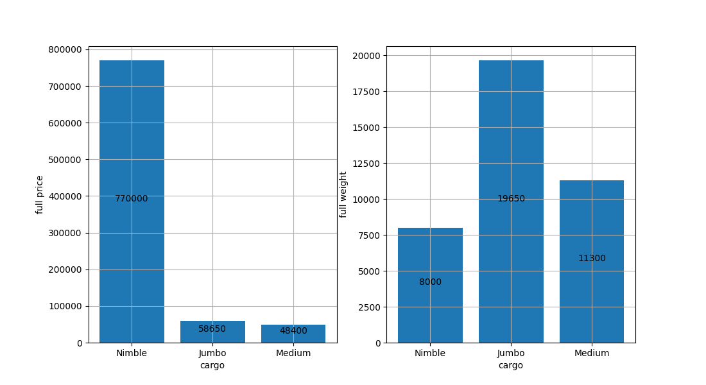

## Эпизод 1
В наши руки попали данные о платежах некоторой глубоко законспирированной организации.
Судя по всему, поля в данных следует воспринимать предельно просто: CONTRACTOR - кому платёж, STATUS - статус операции, SUM - сумма операции. 

### Задача 1: найти 3 самых крупных платежа из реально проведённых (статус OK).
```Python
import pandas as pd

transactions = pd.read_csv('transactions.csv', delimiter=',')
transactions = transactions.drop(transactions[transactions['STATUS'] != 'OK'].index)
contractor = list(transactions['CONTRACTOR'])
sums = list(transactions['SUM'])
print('Самые крупные платежи:', *sorted(sums, reverse=True)[:3])
```

Вывод программы:
```
Самые крупные платежи: 100500 1000 999
```

### Задача 2: определить полную сумму реально проведённых платежей в адрес Umbrella, Inc.
```Python
sum_to_um = 0
for c in contractor:
    if c == 'Umbrella, Inc':
        sum_to_um += int(sums[contractor.index(c)])
print('Полная сумма, отправленная Umbrella, Inc:', sum_to_um)
```

Вывод программы:
```
Полная сумма, отправленная Umbrella, Inc: 1286220
```


## Эпизод 2
У нас есть набор данных о грузовых рейсах - вот он. Поля в данных: CARGO - авиакомпания, PRICE - стоимость груза на борту, WEIGHT - масса груза на борту.

### Задача: посчитать, сколько рейсов выполнила каждая авиакомпания, полную стоимость и полную массу перевезённых ей грузов. Построить график уместного вида с результатами.
```Python
flights = pd.read_csv('flights.csv', delimiter=',')
cargo = list(flights['CARGO'])
price = list(flights['PRICE'])
weight = list(flights['WEIGHT'])
cargos = dict()
for c in cargo:
    i = cargo.index(c)
    if c not in cargos.keys():
        cargos[c] = [price[i], weight[i]]
    else:
        cargos[c][0] += price[i]
        cargos[c][1] += weight[i]
p = [cargos[k][0] for k in cargos.keys()]
w = [cargos[k][1] for k in cargos.keys()]
# print(cargos)
fig, ax = plt.subplots(nrows=1, ncols=2)
fig.set_size_inches(11, 6)
ax[0].bar(list(cargos.keys()), p)
for i in range(len(list(cargos.keys()))):
    ax[0].text(i, p[i] // 2, p[i], ha='center')
ax[0].grid()
ax[0].set_xlabel('cargo')
ax[0].set_ylabel('full price')
ax[1].bar(list(cargos.keys()), w)
for i in range(len(list(cargos.keys()))):
    ax[1].text(i, w[i] // 2, w[i], ha='center')
ax[1].grid()
ax[1].set_xlabel('cargo')
ax[1].set_ylabel('full weight')
plt.savefig('pd1.png')
plt.show()
```

Полученный словарь:
```
{'Nimble': [770000, 8000], 'Jumbo': [58650, 19650], 'Medium': [48400, 11300]}
```

И график:




## Эпизод 3
Однажды один факультет 1-го сентября 1-го курса писал входное тестирование по информатике. В архиве xlsx с данными групп от деканата и html-ная таблица результатов из ejudge. 

В xlsx-файле логины студентов (поле login), номера их факультетских групп (поле group_faculty), номера их групп после распределения на группы по информатике (поле group_out).

### Задание 1: построить графики среднего количества решённых задач (а) по факультетским группам, (б) по группам по информатике
```Python
info = pd.read_excel('students_info.xlsx')
login = list(info['login'])
group_faculty = list(info['group_faculty'])
group_out = list(info['group_out'])
results = pd.read_html('results_ejudge.html')[0]
users = list(results['User'])
solved = list(results['Solved'])
average_group = dict()
average_info = dict()
for i in range(len(users)):
    if users[i] in login:
        inf = group_out[login.index(users[i])]
        group = group_faculty[login.index(users[i])]
        if group not in average_group.keys():
            average_group[group] = [solved[i], 1]
        else:
            average_group[group][0] += solved[i]
            average_group[group][1] += 1
        if inf not in average_info.keys():
            average_info[inf] = [solved[i], 1]
        else:
            average_info[inf][0] += solved[i]
            average_info[inf][1] += 1

x1 = list(average_group.keys())
y1 = list(round(i[1][0] / i[1][1], 2) for i in average_group.items())
x2 = list(average_info.keys())
y2 = list(round(i[1][0] / i[1][1], 2) for i in average_info.items())
plt.bar(x1, y1)
for i in range(len(x1)):
    plt.text(x1[i], y1[i], y1[i], ha='center')
plt.grid()
plt.xlabel('group_faculty')
plt.ylabel('average solved')
plt.savefig('pd2.png')
plt.show()
plt.bar(x2, y2)
for i in range(len(x2)):
    plt.text(x2[i], y2[i], y2[i], ha='center')
plt.grid()
plt.xlabel('group_out')
plt.ylabel('average solved')
plt.savefig('pd3.png')
plt.show()
```

Полученные графики:


