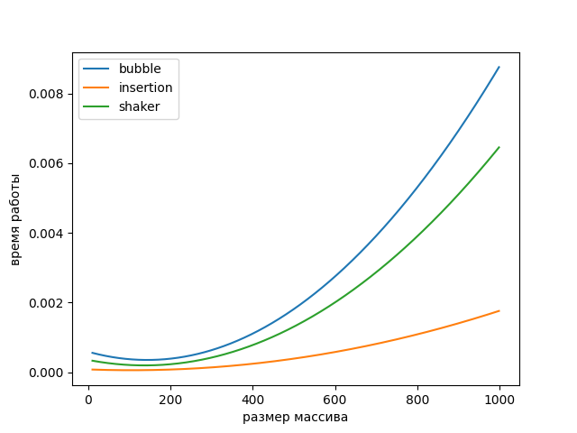
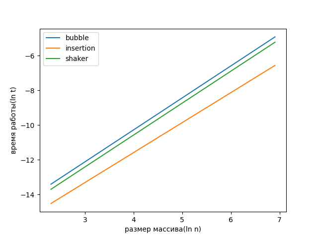
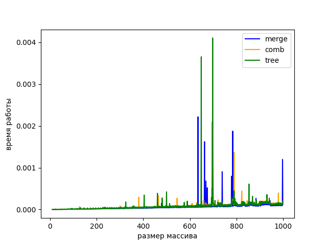
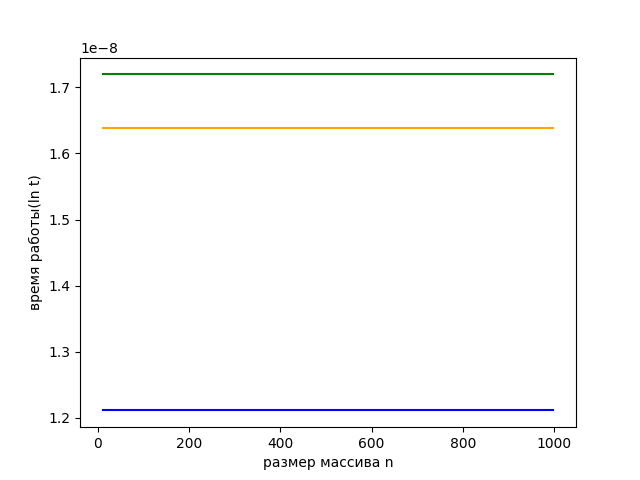
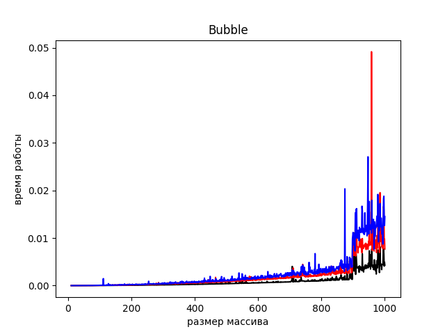
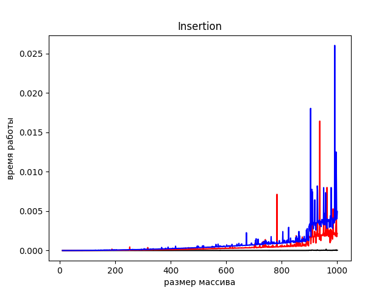
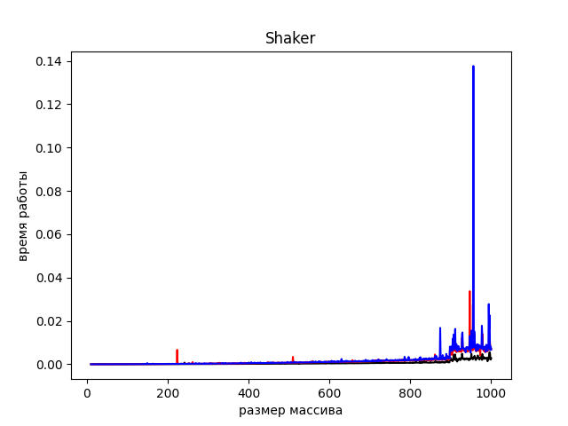
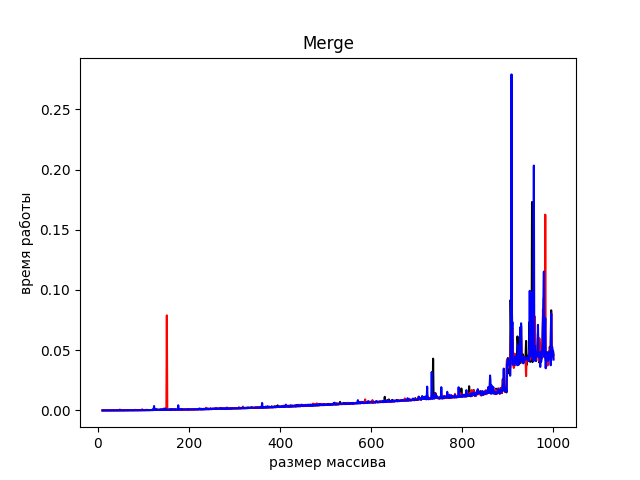
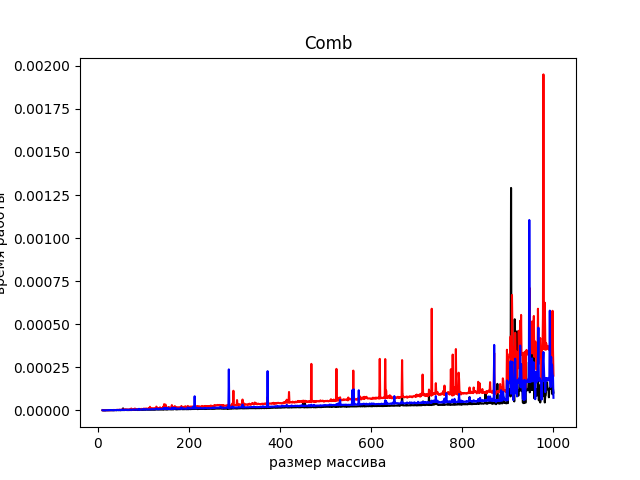
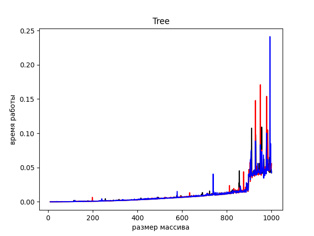

### 0. Пузырек и его товарищи
Сортировка пузырьком, вставками, шейкер:
```C++
#include <bits/stdc++.h>
#include <chrono>
#include <random>
#include <fstream>

double get_time() {
    return std::chrono::duration_cast<std::chrono::microseconds>
                   (std::chrono::steady_clock::now().time_since_epoch()).count() / 1e6;
}

int rand_uns(int min, int max) {
    unsigned seed = std::chrono::steady_clock::now().time_since_epoch().count();
    static std::default_random_engine e(seed);
    std::uniform_int_distribution<int> d(min, max);
    return d(e);
}

std::vector<int> bubble_sort(std::vector<int> v) {
    for (int i = 0; i < v.size(); i++) {
        for (int j = 0; j < v.size() - i - 1; j++)
            if (v[j] > v[j + 1]) std::swap(v[j], v[j + 1]);
    }
    return v;
}

std::vector<int> insertion_sort(std::vector<int> v) {
    int i, k, j;
    for (i = 1; i < v.size(); i++) {
        k = v[i];
        j = i - 1;
        while (j >= 0 && v[j] > k) {
            v[j + 1] = v[j];
            j = j - 1;
        }
        v[j + 1] = k;
    }
    return v;
}

std::vector<int> shaker_sort(std::vector<int> v) {
    int left = 1, right = v.size() - 1;
    while (left <= right) {
        for (int i = right; i >= left; i--)
            if (v[i - 1] > v[i]) std::swap(v[i], v[i - 1]);
        left++;
        for (int i = left; i <= right; i++)
            if (v[i - 1] > v[i]) std::swap(v[i], v[i - 1]);
        right--;
    }
    return v;
}

int main() {
    int n, q;
    std::ofstream f1("time_sort1.csv", std::ios::out);
    std::ofstream f2("time_sort2.csv", std::ios::out);
    std::ofstream f3("time_sort3.csv", std::ios::out);

    for (n = 10; n < 1000; n++) {
        std::vector<int> v;
        for (int i = 0; i < n; i++) v.push_back(rand_uns(1, 10000));
        auto start1 = get_time();
        std::vector<int> v1 = bubble_sort(v);
        auto end1 = get_time();
        auto time1 = end1 - start1;
        f1 << time1 << "\n";
        auto start2 = get_time();
        std::vector<int> v2 = insertion_sort(v);
        auto end2 = get_time();
        auto time2 = end2 - start2;
        f2 << time2 << "\n";
        auto start3 = get_time();
        std::vector<int> v3 = shaker_sort(v);
        auto end3 = get_time();
        auto time3 = end3 - start3;
        f3 << time3 << "\n";
    }
}
```
```Python
import matplotlib.pyplot as plt
import numpy as np

time_1 = [float(i.strip()) for i in
        open('C:\\Users\\amali\\CLionProjects\\untitled1\\cmake-build-debug\\time_sort1.csv', 'r').readlines()]
time_2 = [float(i.strip()) for i in
        open('C:\\Users\\amali\\CLionProjects\\untitled1\\cmake-build-debug\\time_sort2.csv', 'r').readlines()]
time_3 = [float(i.strip()) for i in
        open('C:\\Users\\amali\\CLionProjects\\untitled1\\cmake-build-debug\\time_sort3.csv', 'r').readlines()]
n = np.arange(10, 1000)
y1 = np.polyval(np.polyfit(n, time_1, 2), n)
y2 = np.polyval(np.polyfit(n, time_2, 2), n)
y3 = np.polyval(np.polyfit(n, time_3, 2), n)
plt.plot(n, y1)
plt.plot(n, y2)
plt.plot(n, y3)
plt.xlabel('размер массива')
plt.ylabel('время работы')
plt.legend(['bubble', 'insertion', 'shaker'])

plt.show()
```



```Python
import matplotlib.pyplot as plt
import numpy as np
import math

time_1 = [float(i.strip()) for i in
        open('C:\\Users\\amali\\CLionProjects\\untitled1\\cmake-build-debug\\time_sort1.csv', 'r').readlines()]
time_2 = [float(i.strip()) for i in
        open('C:\\Users\\amali\\CLionProjects\\untitled1\\cmake-build-debug\\time_sort2.csv', 'r').readlines()]
time_3 = [float(i.strip()) for i in
        open('C:\\Users\\amali\\CLionProjects\\untitled1\\cmake-build-debug\\time_sort3.csv', 'r').readlines()]
n = [math.log(i, math.e) for i in np.arange(10, 1000)]

y1 = np.polyval(np.polyfit(n, [math.log(abs(i), math.e) for i in time_1], 1), n)
y2 = np.polyval(np.polyfit(n, [math.log(abs(i), math.e) for i in time_2], 1), n)
y3 = np.polyval(np.polyfit(n, [math.log(abs(i), math.e) for i in time_3], 1), n)
plt.plot(n, y1)
plt.plot(n, y2)
plt.plot(n, y3)
plt.xlabel('размер массива(ln n)')
plt.ylabel('время работы(ln t)')
plt.legend(['bubble', 'insertion', 'shaker'])
plt.savefig('0_d.png')

plt.show()
```




### 2. А теперь настоящие быстрые сортировки
Сортировка слиянием, расческа и двоичным деревом
```C++
#include <bits/stdc++.h>
#include <chrono>
#include <random>
#include <fstream>

struct Node {
    int data;
    Node *left;
    Node *right;

    Node(int value) {
        data = value;
        left = nullptr;
        right = nullptr;
    }
};

double get_time() {
    return std::chrono::duration_cast<std::chrono::microseconds>
                   (std::chrono::steady_clock::now().time_since_epoch()).count() / 1e6;
}

int rand_uns(int min, int max) {
    unsigned seed = std::chrono::steady_clock::now().time_since_epoch().count();
    static std::default_random_engine e(seed);
    std::uniform_int_distribution<int> d(min, max);
    return d(e);
}

void merge(int *arr, int p, int q, int r) {
    int n1 = q - p + 1;
    int n2 = r - q;
    int L[n1], M[n2];

    for (int i = 0; i < n1; i++)
        L[i] = arr[p + i];
    for (int j = 0; j < n2; j++)
        M[j] = arr[q + 1 + j];
    int i, j, k;
    i = 0;
    j = 0;
    k = p;
    while (i < n1 && j < n2) {
        if (L[i] <= M[j]) {
            arr[k] = L[i];
            i++;
        } else {
            arr[k] = M[j];
            j++;
        }
        k++;
    }
    while (i < n1) {
        arr[k] = L[i];
        i++;
        k++;
    }
    while (j < n2) {
        arr[k] = M[j];
        j++;
        k++;
    }
}

void merge_sort(int *arr, int l, int r) {
    if (l < r) {
        int m = l + (r - l) / 2;
        merge_sort(arr, l, m);
        merge_sort(arr, m + 1, r);
        merge(arr, l, m, r);
    }
}

Node *insert(Node *root, int value) {
    if (root == nullptr) {
        return new Node(value);
    }
    if (value < root->data) root->left = insert(root->left, value);
    else root->right = insert(root->right, value);
    return root;
}

void in_order(Node *root) {
    if (root != nullptr) {
        in_order(root->left);
        in_order(root->right);
    }
}

void tree_sort(std::vector<int> v) {
    Node* root = nullptr;
    for (int i = 0; i < v.size(); i++) {
        root = insert(root, v[i]);
    }
    in_order(root);
}

void comb_sort(std::vector<int> arr) {
    int n = arr.size();
    int gap = n;
    float shrink = 1.3;
    bool swapped = true;

    while (gap > 1 || swapped) {
        gap = (int) ((float)gap / shrink);
        if (gap < 1) gap = 1;
        swapped = false;
        for (int i = 0; i < n - gap; i++)
            if (arr[i] > arr[i + gap]) {
                std::swap(arr[i], arr[i + gap]);
                swapped = true;
            }
    }
}

int main() {
    int n;
    std::ofstream f1("time_sort4.csv", std::ios::out);
    std::ofstream f2("time_sort5.csv", std::ios::out);
    std::ofstream f3("time_sort6.csv", std::ios::out);

    for (n = 10; n < 1000; n++) {
        std::vector<int> v03, v02;
        int arr[n];
        for (int i = 0; i < n; i++) {
            v03.push_back(rand_uns(1, 10000));
            v02.push_back(rand_uns(1, 10000));
            arr[i] = rand_uns(1, 10000);
        }

        auto start1 = get_time();
        merge_sort(arr, 0, n - 1);
        auto end1 = get_time();
        auto time1 = end1 - start1;
        f1 << time1 << "\n";
        auto start2 = get_time();
        comb_sort(v02);
        auto end2 = get_time();
        auto time2 = end2 - start2;
        f2 << time2 << "\n";
        auto start3 = get_time();
        tree_sort(v03);
        auto end3 = get_time();
        auto time3 = end3 - start3;
        f3 << time3 << "\n";
    }
}
```
```Python
import matplotlib.pyplot as plt
import numpy as np
import math

time_4 = [float(i.strip()) for i in
           open('C:\\Users\\amali\\CLionProjects\\untitled1\\cmake-build-debug\\time_sort4.csv', 'r').readlines()]
time_5 = [float(i.strip()) for i in
           open('C:\\Users\\amali\\CLionProjects\\untitled1\\cmake-build-debug\\time_sort5.csv', 'r').readlines()]
time_6 = [float(i.strip()) for i in
           open('C:\\Users\\amali\\CLionProjects\\untitled1\\cmake-build-debug\\time_sort6.csv', 'r').readlines()]

n = [i for i in np.arange(10, 1000)]

plt.plot(n, time_4, color='blue')
plt.plot(n, time_5, color="orange")
plt.plot(n, time_6, color="green")
plt.xlabel('размер массива')
plt.ylabel('время работы')
plt.legend(['merge', 'comb', 'tree'])
plt.show()
```



```Python
import matplotlib.pyplot as plt
import numpy as np
import math

time_4 = [float(i.strip()) for i in
           open('C:\\Users\\amali\\CLionProjects\\untitled1\\cmake-build-debug\\time_sort4.csv', 'r').readlines()]
time_5 = [float(i.strip()) for i in
           open('C:\\Users\\amali\\CLionProjects\\untitled1\\cmake-build-debug\\time_sort5.csv', 'r').readlines()]
time_6 = [float(i.strip()) for i in
           open('C:\\Users\\amali\\CLionProjects\\untitled1\\cmake-build-debug\\time_sort6.csv', 'r').readlines()]

n = [i for i in np.arange(10, 1000)]

y4 = np.polyval(np.polyfit(n, [time_4[i] / (n[i] * math.log(n[i], 2)) for i in range(len(n))], 0), n)
y5 = np.polyval(np.polyfit(n, [time_5[i] / (n[i] * math.log(n[i], 2)) for i in range(len(n))], 0), n)
y6 = np.polyval(np.polyfit(n, [time_6[i] / (n[i] * math.log(n[i], 2)) for i in range(len(n))], 0), n)
plt.plot(n, y4, color='blue')
plt.plot(n, y5, color='orange')
plt.plot(n, y6, color='green')
plt.xlabel('размер массива n')
plt.ylabel('время работы(ln t)')
plt.show()
```



### 3. O(N^2) vs O(N log N)
```Python
import matplotlib.pyplot as plt
import numpy as np
import math

time_1 = [float(i.strip()) for i in
          open('C:\\Users\\amali\\CLionProjects\\untitled1\\cmake-build-debug\\time_sort1.csv', 'r').readlines()]

time_2 = [float(i.strip()) for i in
          open('C:\\Users\\amali\\CLionProjects\\untitled1\\cmake-build-debug\\time_sort2.csv', 'r').readlines()]
time_3 = [float(i.strip()) for i in
          open('C:\\Users\\amali\\CLionProjects\\untitled1\\cmake-build-debug\\time_sort3.csv', 'r').readlines()]
time_4 = [float(i.strip()) for i in
           open('C:\\Users\\amali\\CLionProjects\\untitled1\\cmake-build-debug\\time_sort4.csv', 'r').readlines()]
time_5 = [float(i.strip()) for i in
           open('C:\\Users\\amali\\CLionProjects\\untitled1\\cmake-build-debug\\time_sort5.csv', 'r').readlines()]
time_6 = [float(i.strip()) for i in
           open('C:\\Users\\amali\\CLionProjects\\untitled1\\cmake-build-debug\\time_sort6.csv', 'r').readlines()]

n = [i for i in np.arange(10, 1000)]

plt.plot(n, time_1, color='black')
plt.plot(n, time_2, color='red')
plt.plot(n, time_3, color='purple')
plt.plot(n, time_4, color='blue')
plt.plot(n, time_5, color="orange")
plt.plot(n, time_6, color='green')
plt.xlabel('размер массива')
plt.ylabel('время работы')
plt.legend(['bubble', 'insertion', 'shaker', 'merge', 'comb', 'tree'])
plt.show()
```


### 4. Зависимость от начальных данных
```C++
#include <bits/stdc++.h>
#include <chrono>
#include <random>
#include <fstream>

struct Node {
    int data;
    Node *left;
    Node *right;

    Node(int value) {
        data = value;
        left = nullptr;
        right = nullptr;
    }
};

double get_time() {
    return std::chrono::duration_cast<std::chrono::microseconds>
                   (std::chrono::steady_clock::now().time_since_epoch()).count() / 1e6;
}

int rand_uns(int min, int max) {
    unsigned seed = std::chrono::steady_clock::now().time_since_epoch().count();
    static std::default_random_engine e(seed);
    std::uniform_int_distribution<int> d(min, max);
    return d(e);
}

void merge(std::vector<int> arr, int p, int q, int r) {
    int n1 = q - p + 1;
    int n2 = r - q;
    int L[n1], M[n2];

    for (int i = 0; i < n1; i++)
        L[i] = arr[p + i];
    for (int j = 0; j < n2; j++)
        M[j] = arr[q + 1 + j];
    int i, j, k;
    i = 0;
    j = 0;
    k = p;
    while (i < n1 && j < n2) {
        if (L[i] <= M[j]) {
            arr[k] = L[i];
            i++;
        } else {
            arr[k] = M[j];
            j++;
        }
        k++;
    }
    while (i < n1) {
        arr[k] = L[i];
        i++;
        k++;
    }
    while (j < n2) {
        arr[k] = M[j];
        j++;
        k++;
    }
}

void merge_sort(std::vector<int> arr, int l, int r) {
    if (l < r) {
        int m = l + (r - l) / 2;
        merge_sort(arr, l, m);
        merge_sort(arr, m + 1, r);
        merge(arr, l, m, r);
    }
}

Node *insert(Node *root, int value) {
    if (root == nullptr) {
        return new Node(value);
    }
    if (value < root->data) root->left = insert(root->left, value);
    else root->right = insert(root->right, value);
    return root;
}

void in_order(Node *root) {
    if (root != nullptr) {
        in_order(root->left);
        in_order(root->right);
    }
}

void tree_sort(std::vector<int> v) {
    Node *root = nullptr;
    for (int i = 0; i < v.size(); i++) {
        root = insert(root, v[i]);
    }
    in_order(root);
}

void comb_sort(std::vector<int> arr) {
    int n = arr.size();
    int gap = n;
    float shrink = 1.3;
    bool swapped = true;

    while (gap > 1 || swapped) {
        gap = (int) ((float) gap / shrink);
        if (gap < 1) gap = 1;
        swapped = false;
        for (int i = 0; i < n - gap; i++)
            if (arr[i] > arr[i + gap]) {
                std::swap(arr[i], arr[i + gap]);
                swapped = true;
            }
    }
}

std::vector<int> bubble_sort(std::vector<int> v) {
    for (int i = 0; i < v.size(); i++) {
        for (int j = 0; j < v.size() - i - 1; j++)
            if (v[j] > v[j + 1]) std::swap(v[j], v[j + 1]);
    }
    return v;
}

std::vector<int> insertion_sort(std::vector<int> v) {
    int i, k, j;
    for (i = 1; i < v.size(); i++) {
        k = v[i];
        j = i - 1;
        while (j >= 0 && v[j] > k) {
            v[j + 1] = v[j];
            j = j - 1;
        }
        v[j + 1] = k;
    }
    return v;
}

std::vector<int> shaker_sort(std::vector<int> v) {
    int left = 1, right = v.size() - 1;
    while (left <= right) {
        for (int i = right; i >= left; i--)
            if (v[i - 1] > v[i]) std::swap(v[i], v[i - 1]);
        left++;
        for (int i = left; i <= right; i++)
            if (v[i - 1] > v[i]) std::swap(v[i], v[i - 1]);
        right--;
    }
    return v;
}

int main() {
    int n;

    std::ofstream f1_b("1_best.csv", std::ios::out);
    std::ofstream f2_b("2_best.csv", std::ios::out);
    std::ofstream f3_b("3_best.csv", std::ios::out);
    std::ofstream f4_b("4_best.csv", std::ios::out);
    std::ofstream f5_b("5_best.csv", std::ios::out);
    std::ofstream f6_b("6_best.csv", std::ios::out);
    std::ofstream f1_m("1_med.csv", std::ios::out);
    std::ofstream f2_m("2_med.csv", std::ios::out);
    std::ofstream f3_m("3_med.csv", std::ios::out);
    std::ofstream f4_m("4_med.csv", std::ios::out);
    std::ofstream f5_m("5_med.csv", std::ios::out);
    std::ofstream f6_m("6_med.csv", std::ios::out);
    std::ofstream f1_w("1_worst.csv", std::ios::out);
    std::ofstream f2_w("2_worst.csv", std::ios::out);
    std::ofstream f3_w("3_worst.csv", std::ios::out);
    std::ofstream f4_w("4_worst.csv", std::ios::out);
    std::ofstream f5_w("5_worst.csv", std::ios::out);
    std::ofstream f6_w("6_worst.csv", std::ios::out);


    for (n = 10; n < 1000; n++) {
        std::vector<int> v01_best, v02_best, v03_best;
        std::vector<int> v01_med, v02_med, v03_med;
        std::vector<int> v01_worst, v02_worst, v03_worst;
        std::vector<int> v_best, v_med, v_worst;
        for (int i = 0; i < n; i++) {
            v01_best.push_back(rand_uns(1, 10000));
            v02_best.push_back(rand_uns(1, 10000));
            v03_best.push_back(rand_uns(1, 10000));
            v01_med.push_back(rand_uns(1, 10000));
            v02_med.push_back(rand_uns(1, 10000));
            v03_med.push_back(rand_uns(1, 10000));
            v01_worst.push_back(rand_uns(1, 10000));
            v02_worst.push_back(rand_uns(1, 10000));
            v03_worst.push_back(rand_uns(1, 10000));
            v_best.push_back(rand_uns(1, 10000));
            v_med.push_back(rand_uns(1, 10000));
            v_worst.push_back(rand_uns(1, 10000));
        }
        std::sort(v01_best.begin(), v01_best.end());
        std::sort(v02_best.begin(), v02_best.end());
        std::sort(v03_best.begin(), v03_best.end());
        std::sort(v_best.begin(), v_best.end());

        std::sort(v01_worst.rbegin(), v01_worst.rend());
        std::sort(v02_worst.rbegin(), v02_worst.rend());
        std::sort(v03_worst.rbegin(), v03_worst.rend());
        std::sort(v_worst.rbegin(), v_worst.rend());

        auto start1_best = get_time();
        std::vector<int> v1_b = bubble_sort(v_best);
        auto end1_best = get_time();
        auto time1_best = end1_best - start1_best;
        f1_b << time1_best << "\n";
        auto start1_med = get_time();
        std::vector<int> v1_m = bubble_sort(v_med);
        auto end1_med = get_time();
        auto time1_med = end1_med - start1_med;
        f1_m << time1_med << "\n";
        auto start1_worst = get_time();
        std::vector<int> v1_w = bubble_sort(v_worst);
        auto end1_worst = get_time();
        auto time1_worst = end1_worst - start1_worst;
        f1_w << time1_worst << "\n";


        auto start2_best = get_time();
        std::vector<int> v2_b = insertion_sort(v_best);
        auto end2_best = get_time();
        auto time2_best = end2_best - start2_best;
        f2_b << time2_best << "\n";
        auto start2_med = get_time();
        std::vector<int> v2_m = insertion_sort(v_med);
        auto end2_med = get_time();
        auto time2_med = end2_med - start2_med;
        f2_m << time2_med << "\n";
        auto start2_worst = get_time();
        std::vector<int> v2_w = insertion_sort(v_worst);
        auto end2_worst = get_time();
        auto time2_worst = end2_worst - start2_worst;
        f2_w << time2_worst << "\n";

        auto start3_best = get_time();
        std::vector<int> v3_b = shaker_sort(v_best);
        auto end3_best = get_time();
        auto time3_best = end3_best - start3_best;
        f3_b << time3_best << "\n";
        auto start3_med = get_time();
        std::vector<int> v3_m = shaker_sort(v_med);
        auto end3_med = get_time();
        auto time3_med = end3_med - start3_med;
        f3_m << time3_med << "\n";
        auto start3_worst = get_time();
        std::vector<int> v3_w = shaker_sort(v_worst);
        auto end3_worst = get_time();
        auto time3_worst = end3_worst - start3_worst;
        f3_w << time3_worst << "\n";

        auto start4_best = get_time();
        merge_sort(v01_best, 0, n - 1);
        auto end4_best = get_time();
        auto time4_best = end4_best - start4_best;
        f4_b << time4_best << "\n";
        auto start4_med = get_time();
        merge_sort(v01_med, 0, n - 1);
        auto end4_med = get_time();
        auto time4_med = end4_med - start4_med;
        f4_m << time4_med << "\n";
        auto start4_worst = get_time();
        merge_sort(v01_worst, 0, n - 1);
        auto end4_worst = get_time();
        auto time4_worst = end4_worst - start4_worst;
        f4_w << time4_worst << "\n";

        auto start5_best = get_time();
        comb_sort(v02_best);
        auto end5_best = get_time();
        auto time5_best = end5_best - start5_best;
        f5_b << time5_best << "\n";
        auto start5_med = get_time();
        comb_sort(v02_med);
        auto end5_med = get_time();
        auto time5_med = end5_med - start5_med;
        f5_m << time5_med << "\n";
        auto start5_worst = get_time();
        comb_sort(v02_worst);
        auto end5_worst = get_time();
        auto time5_worst = end5_worst - start5_worst;
        f5_w << time5_worst << "\n";

        auto start6_best = get_time();
        merge_sort(v03_best, 0, n - 1);
        auto end6_best = get_time();
        auto time6_best = end6_best - start6_best;
        f6_b << time6_best << "\n";
        auto start6_med = get_time();
        merge_sort(v03_med, 0, n - 1);
        auto end6_med = get_time();
        auto time6_med = end6_med - start6_med;
        f6_m << time6_med << "\n";
        auto start6_worst = get_time();
        merge_sort(v03_best, 0, n - 1);
        auto end6_worst = get_time();
        auto time6_worst = end6_worst - start6_worst;
        f6_w << time6_worst << "\n";
    }
}
```
```Python
import matplotlib.pyplot as plt
import numpy as np
import math

time_1_best = [float(i.strip()) for i in
          open('C:\\Users\\amali\\CLionProjects\\untitled1\\cmake-build-debug\\1_best.csv', 'r').readlines()]
time_1_med = [float(i.strip()) for i in
          open('C:\\Users\\amali\\CLionProjects\\untitled1\\cmake-build-debug\\1_med.csv', 'r').readlines()]
time_1_worst = [float(i.strip()) for i in
          open('C:\\Users\\amali\\CLionProjects\\untitled1\\cmake-build-debug\\1_worst.csv', 'r').readlines()]

time_2_best = [float(i.strip()) for i in
          open('C:\\Users\\amali\\CLionProjects\\untitled1\\cmake-build-debug\\2_best.csv', 'r').readlines()]
time_2_med = [float(i.strip()) for i in
          open('C:\\Users\\amali\\CLionProjects\\untitled1\\cmake-build-debug\\2_med.csv', 'r').readlines()]
time_2_worst = [float(i.strip()) for i in
          open('C:\\Users\\amali\\CLionProjects\\untitled1\\cmake-build-debug\\2_worst.csv', 'r').readlines()]

time_3_best = [float(i.strip()) for i in
          open('C:\\Users\\amali\\CLionProjects\\untitled1\\cmake-build-debug\\3_best.csv', 'r').readlines()]
time_3_med = [float(i.strip()) for i in
          open('C:\\Users\\amali\\CLionProjects\\untitled1\\cmake-build-debug\\3_med.csv', 'r').readlines()]
time_3_worst = [float(i.strip()) for i in
          open('C:\\Users\\amali\\CLionProjects\\untitled1\\cmake-build-debug\\3_worst.csv', 'r').readlines()]

time_4_best = [float(i.strip()) for i in
          open('C:\\Users\\amali\\CLionProjects\\untitled1\\cmake-build-debug\\4_best.csv', 'r').readlines()]
time_4_med = [float(i.strip()) for i in
          open('C:\\Users\\amali\\CLionProjects\\untitled1\\cmake-build-debug\\4_med.csv', 'r').readlines()]
time_4_worst = [float(i.strip()) for i in
          open('C:\\Users\\amali\\CLionProjects\\untitled1\\cmake-build-debug\\4_worst.csv', 'r').readlines()]

time_5_best = [float(i.strip()) for i in
          open('C:\\Users\\amali\\CLionProjects\\untitled1\\cmake-build-debug\\5_best.csv', 'r').readlines()]
time_5_med = [float(i.strip()) for i in
          open('C:\\Users\\amali\\CLionProjects\\untitled1\\cmake-build-debug\\5_med.csv', 'r').readlines()]
time_5_worst = [float(i.strip()) for i in
          open('C:\\Users\\amali\\CLionProjects\\untitled1\\cmake-build-debug\\5_worst.csv', 'r').readlines()]

time_6_best = [float(i.strip()) for i in
          open('C:\\Users\\amali\\CLionProjects\\untitled1\\cmake-build-debug\\6_best.csv', 'r').readlines()]
time_6_med = [float(i.strip()) for i in
          open('C:\\Users\\amali\\CLionProjects\\untitled1\\cmake-build-debug\\6_med.csv', 'r').readlines()]
time_6_worst = [float(i.strip()) for i in
          open('C:\\Users\\amali\\CLionProjects\\untitled1\\cmake-build-debug\\6_worst.csv', 'r').readlines()]

n = np.linspace(10, 1000, len(time_1_best))

plt.plot(n, time_1_best, color='black')
plt.plot(n, time_1_med, color='red')
plt.plot(n, time_1_worst, color='blue')
plt.xlabel('размер массива')
plt.ylabel('время работы')
plt.title('Bubble')
plt.savefig('1_bmw.png')
plt.show()

plt.plot(n, time_2_best, color='black')
plt.plot(n, time_2_med, color='red')
plt.plot(n, time_2_worst, color='blue')
plt.xlabel('размер массива')
plt.ylabel('время работы')
plt.title('Insertion')
plt.savefig('2_bmw.png')
plt.show()

plt.plot(n, time_3_best, color='black')
plt.plot(n, time_3_med, color='red')
plt.plot(n, time_3_worst, color='blue')
plt.xlabel('размер массива')
plt.ylabel('время работы')
plt.title('Shaker')
plt.savefig('3_bmw.png')
plt.show()

plt.plot(n, time_4_best, color='black')
plt.plot(n, time_4_med, color='red')
plt.plot(n, time_4_worst, color='blue')
plt.xlabel('размер массива')
plt.ylabel('время работы')
plt.title('Merge')
plt.savefig('4_bmw.png')
plt.show()

plt.plot(n, time_5_best, color='black')
plt.plot(n, time_5_med, color='red')
plt.plot(n, time_5_worst, color='blue')
plt.xlabel('размер массива')
plt.ylabel('время работы')
plt.title('Comb')
plt.savefig('5_bmw.png')
plt.show()

plt.plot(n, time_6_best, color='black')
plt.plot(n, time_6_med, color='red')
plt.plot(n, time_6_worst, color='blue')
plt.xlabel('размер массива')
plt.ylabel('время работы')
plt.title('Tree')
plt.savefig('6_bmw.png')
plt.show()
```












