# Лаба по контейнерам
<details>
<summary><h3>0. Пример с лекции - push_back для vector.</h3></summary>
    
График: capacity и size от i (номера итерации).
```C++
#include <iostream>
#include <fstream>
#include <vector>


int main() {
    std::vector<int> v;
    std::ofstream f("0.csv", std::ios::out);
    for (int i = 0; i < 1024; i++) {
        v.push_back(i);
        if (i % 50 == 0) {
            unsigned int cap = v.capacity();
            unsigned int s = v.size();
            f << i << " " << cap << " " << s << "\n";
        }
    }
}
```

</details>

<details>
<summary><h3>1. Среднее время вставки элемента в произвольное место вектора.</h3></summary>
Реализуйте для своего контейнера insert, измерьте среднее время для различного размера контейнера (size) при вставке в произвольное место, сравните со стандартным контейнером. График: среднее время вставки для vector и subvector от size. Определить асимптотику.

subvector:
```C++
#include <iostream>
#include <fstream>
#include <random>
#include <chrono>

double get_time() {
    return std::chrono::duration_cast<std::chrono::microseconds>
                   (std::chrono::steady_clock::now().time_since_epoch()).count() / 1e6;
}

struct subvector {
    int *mas;
    unsigned int top;
    unsigned int capacity;
};

bool init(subvector* sv) {
    sv -> mas = NULL;
    sv -> top = 0;
    sv -> capacity = 0;
    return true;
}

bool resize(subvector* sv, unsigned int new_capacity) {
    sv -> capacity = new_capacity;
    return true;
}

bool push_back(subvector* sv, int d) {
    sv -> top += 1;
    if (sv -> top - 1 == 0) {
        if (sv -> capacity == 0) {
            sv -> capacity = 1;
            int* new_mas = new int[sv -> capacity];
            delete[] sv -> mas;
            sv -> mas = new_mas;
        }
        (sv -> mas)[sv -> top - 1] = d;
    }
    else if (sv -> top > sv -> capacity) {
        unsigned int cur_cap = sv -> capacity;
        resize(sv, cur_cap * 2);
        int* new_mas = new int[sv -> capacity];
        for (unsigned int i = 0; i < (sv -> top - 1); i++) {
            new_mas[i] = (sv -> mas)[i];
        }
        delete[] sv -> mas;
        sv -> mas = new_mas;
        (sv -> mas)[sv -> top - 1] = d;
    }
    else {
        (sv -> mas)[sv -> top - 1] = d;
    }
    return true;
}

bool insert(subvector* sv, int d, int i) {
    sv -> top += 1;
    if (sv -> top - 1 == 0) {
        if (sv -> capacity == 0) {
            sv -> capacity = 1;
            int* new_mas = new int[sv -> capacity];
            delete[] sv -> mas;
            sv -> mas = new_mas;
        }
        (sv -> mas)[sv -> top - 1] = d;
    }
    else if (sv -> top > sv -> capacity) {
        unsigned int cur_cap = sv -> capacity;
        resize(sv, cur_cap * 2);
        int* new_mas = new int[sv -> capacity];
        for (unsigned int k = 0; k < i; k++) {
            new_mas[k] = (sv -> mas)[k];
        }
        new_mas[i] = d;
        std::cout <<"here";
        for (unsigned int k = i + 1; k < (sv->top - 1); k++) {
            new_mas[k] = (sv->mas)[k - 1];
        }
        delete[] sv -> mas;
        sv -> mas = new_mas;
    }
    else {
        int* new_mas = new int[sv -> capacity];
        for (unsigned int k = 0; k < i; k++) {
            new_mas[k] = (sv -> mas)[k];
        }
        new_mas[i] = d;
        for (unsigned int k = i + 1; k < (sv->top - 1); k++) {
            new_mas[k] = (sv->mas)[k - 1];
        }
        delete[] sv -> mas;
        sv -> mas = new_mas;
    }
    return true;
}

int main() {
    std::ofstream f("1_2.csv", std::ios::out);
    subvector *s;
    init(s);
    for (int i = 0; i < 102400; i++) {
        push_back(s, 1);
        if (i % 500 == 0) {
            unsigned int x = rand() % (i + 1);
            auto start = get_time();
            insert(s, 2, x);
            auto finish = get_time();
            auto time = finish - start;
            f << s->top << " " << time << "\n";
        }
    }
}
```
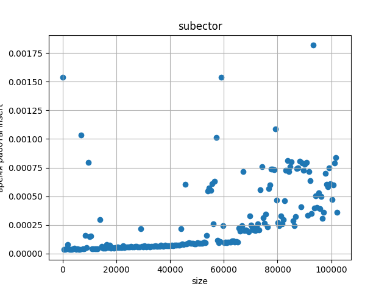
    
для std::vector:
сложность: O(n)
```C++
#include <iostream>
#include <fstream>
#include <vector>
#include <random>
#include <chrono>

double get_time() {
    return std::chrono::duration_cast<std::chrono::microseconds>
                   (std::chrono::steady_clock::now().time_since_epoch()).count() / 1e6;
}

int main() {
    std::vector<int> v;
    std::ofstream f("1_1.csv", std::ios::out);
    for (unsigned int i = 0; i < 102400; i++) {
        v.push_back(i);
        unsigned int x = rand() % (i + 1);
        if (i % 500 == 0) {
            auto start = get_time();
            v.insert(v.begin() + x, i);
            auto finish = get_time();
            auto time = finish - start;
            f << v.size() << " " << time << "\n";
        }
    }
}
```

</details>

<details>
<summary><h3>2. Среднее время удаления одного элемента из произвольного места вектора.</h3></summary>
Реализуйте для своего контейнера erase, измерьте среднее время для различного размера контейнера (size) при вставке в произвольное место, сравните со стандартным контейнером. График: среднее время удаления для vector и subvector от size. Определить асимптотику.

subvector:
```C++
#include <iostream>
#include <fstream>
#include <random>
#include <chrono>

double get_time() {
    return std::chrono::duration_cast<std::chrono::microseconds>
                   (std::chrono::steady_clock::now().time_since_epoch()).count() / 1e6;
}

struct subvector {
    int *mas;
    unsigned int top;
    unsigned int capacity;
};

bool init(subvector* sv) {
    sv -> mas = NULL;
    sv -> top = 0;
    sv -> capacity = 0;
    return true;
}

bool resize(subvector* sv, unsigned int new_capacity) {
    sv -> capacity = new_capacity;
    return true;
}

bool push_back(subvector* sv, int d) {
    sv -> top += 1;
    if (sv -> top - 1 == 0) {
        if (sv -> capacity == 0) {
            sv -> capacity = 1;
            int* new_mas = new int[sv -> capacity];
            delete[] sv -> mas;
            sv -> mas = new_mas;
        }
        (sv -> mas)[sv -> top - 1] = d;
    }
    else if (sv -> top > sv -> capacity) {
        unsigned int cur_cap = sv -> capacity;
        resize(sv, cur_cap * 2);
        int* new_mas = new int[sv -> capacity];
        for (unsigned int i = 0; i < (sv -> top - 1); i++) {
            new_mas[i] = (sv -> mas)[i];
        }
        delete[] sv -> mas;
        sv -> mas = new_mas;
        (sv -> mas)[sv -> top - 1] = d;
    }
    else {
        (sv -> mas)[sv -> top - 1] = d;
    }
    return true;
}

bool erase(subvector* sv, int i) {
    sv -> top -= 1;
    if (sv->top + 1 == 0) {
        sv->top = 0;
    }
    else if (sv -> top > sv -> capacity) {
        unsigned int cur_cap = sv -> capacity;
        resize(sv, cur_cap * 2);
        int* new_mas = new int[sv -> capacity];
        for (unsigned int k = 0; k < (sv->top); k++) {
            if (k == i) continue;
            new_mas[k] = (sv -> mas)[k];
        }
        delete[] sv -> mas;
        sv -> mas = new_mas;
    }
    else {
        int* new_mas = new int[sv -> capacity];
        for (unsigned int k = 0; k < (sv->top); k++) {
            if (k == i) continue;
            new_mas[k] = (sv -> mas)[k];
        }
        delete[] sv -> mas;
        sv -> mas = new_mas;
    }
    return true;
}

int main() {
    std::ofstream f("2_2.csv", std::ios::out);
    subvector *s;
    init(s);
    for (int i = 0; i < 102400; i++) {
        push_back(s, 1);
        if (i % 500 == 0) {
            unsigned int x = rand() % (i + 1);
            auto start = get_time();
            erase(s, x);
            auto finish = get_time();
            auto time = finish - start;
            f << s->top << " " << time << "\n";
        }
    }
}
```
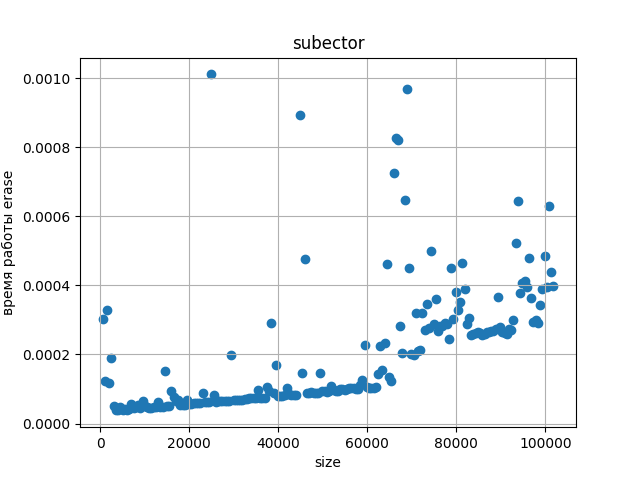

для std::vector:
сложность: O(n)

```C++
#include <iostream>
#include <fstream>
#include <vector>
#include <random>
#include <chrono>

double get_time() {
    return std::chrono::duration_cast<std::chrono::microseconds>
                   (std::chrono::steady_clock::now().time_since_epoch()).count() / 1e6;
}

int main() {
    std::vector<int> v;
    std::ofstream f("2_1.csv", std::ios::out);
    for (unsigned int i = 0; i < 102400; i++) {
        v.push_back(i);
        if (i % 500 == 0) {
            unsigned int x = rand() % (i + 1);
            auto start = get_time();
            v.erase(v.begin() + x);
            auto finish = get_time();
            auto time = finish - start;
            f << v.size() << " " << time << "\n";
        }
    }
}
```

</details>

<details>
<summary><h3>3. Среднее время добавления в начало односвязного списка.</h3></summary>
График: среднее время работы push_front для list, forward_list и subforward_list от size. Определить асимптотику.
    
для std::list и std::forward_list:
сложность: O(1)
```C++
#include <fstream>
#include <random>
#include <chrono>
#include <list>
#include <forward_list>

double get_time() {
    return std::chrono::duration_cast<std::chrono::microseconds>
                   (std::chrono::steady_clock::now().time_since_epoch()).count() / 1e6;
}

int main() {
    std::list<int> l;
    std::forward_list<int> fl;
    std::ofstream f1("3_1.csv", std::ios::out);
    std::ofstream f2("3_2.csv", std::ios::out);
    for (unsigned int i = 0; i < 102400; i++) {

        if (i % 500 == 0) {
            auto start1 = get_time();
            l.push_front(i);
            auto finish1 = get_time();
            auto time1 = finish1 - start1;
            f1 << l.size() << " " << time1 << "\n";

            auto start2 = get_time();
            fl.push_front(i);
            auto finish2 = get_time();
            auto time2 = finish2 - start2;
            f2 << l.size() << " " << time2 << "\n";
            continue;
        }
        l.push_front(i);
        fl.push_front(i);
    }
}
```


</details>

<details>
<summary><h3>4. Среднее время удаления из начала односвязного списка.</h3></summary>
График: среднее время работы pop_front для list, forward_list и subforward_list от size. Определить асимптотику.

для std::list и std::forward_list:
```C++
#include <fstream>
#include <random>
#include <chrono>
#include <list>
#include <forward_list>

double get_time() {
    return std::chrono::duration_cast<std::chrono::microseconds>
                   (std::chrono::steady_clock::now().time_since_epoch()).count() / 1e6;
}

int main() {
    std::list<int> l;
    std::forward_list<int> fl;
    std::ofstream f1("4_1.csv", std::ios::out);
    std::ofstream f2("4_2.csv", std::ios::out);
    for (unsigned int i = 0; i < 102400; i++) {
        l.push_front(i);
        fl.push_front(i);
        if (i % 500 == 0) {
            auto start1 = get_time();
            l.pop_front();
            auto finish1 = get_time();
            auto time1 = finish1 - start1;
            f1 << l.size() << " " << time1 << "\n";

            auto start2 = get_time();
            fl.pop_front();
            auto finish2 = get_time();
            auto time2 = finish2 - start2;
            f2 << l.size() << " " << time2 << "\n";
        }
    }
}
```


</details>

<details>
<summary><h3>5. Среднее время добавления элемента в бинарное дерево.</h3></summary>
График: среднее время работы insert для set, map, multiset и multimap от size. Определить асимптотику.
    
```C++
#include <fstream>
#include <random>
#include <chrono>
#include <set>
#include <map>


double get_time() {
    return std::chrono::duration_cast<std::chrono::microseconds>
                   (std::chrono::steady_clock::now().time_since_epoch()).count() / 1e6;
}

int main() {
    std::set<int> s;
    std::map<int, int> m;
    std::multiset<int> ms;
    std::multimap<int, int> mm;
    std::ofstream f1("5_1.csv", std::ios::out);
    std::ofstream f2("5_2.csv", std::ios::out);
    std::ofstream f3("5_3.csv", std::ios::out);
    std::ofstream f4("5_4.csv", std::ios::out);

    bool record = false;
    auto start1 = get_time();
    auto start2 = get_time();
    auto start3 = get_time();
    auto start4 = get_time();

    for (unsigned int i = 0; i < 102400; i++) {
        if (!record) {
            start1 = get_time();
            start2 = get_time();
            start3 = get_time();
            start4 = get_time();
            record = true;
        }
        s.insert(i);
        ms.insert(i);
        m.insert({i, i});
        mm.insert({i, i});
        if (i != 0 and i % 500 == 0) {
            auto finish1 = get_time();
            auto finish2 = get_time();
            auto finish3 = get_time();
            auto finish4 = get_time();

            auto time1 = (finish1 - start1) / 500;
            auto time2 = (finish2 - start2) / 500;
            auto time3 = (finish3 - start3) / 500;
            auto time4 = (finish4 - start4) / 500;

            f1 << s.size() << " " << time1 << "\n";
            f2 << ms.size() << " " << time2 << "\n";
            f3 << m.size() << " " << time3 << "\n";
            f4 << mm.size() << " " << time4 << "\n";

            record = false;
        }
    }
}
```
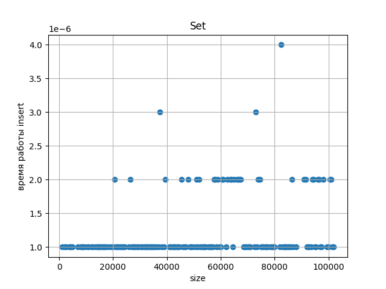
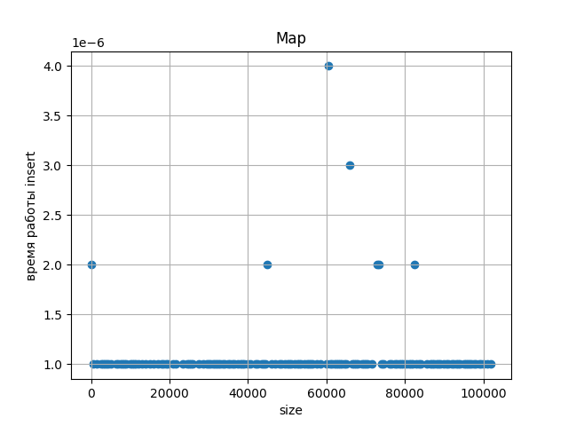
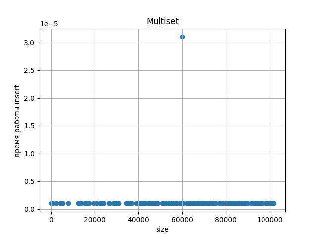
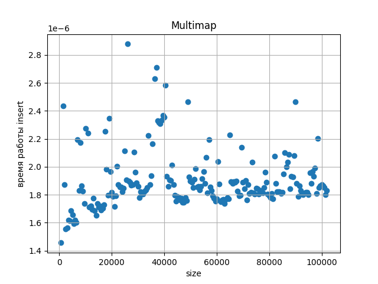
</details>

<details>
<summary><h3>6. Среднее время обхода всего контейнера. </h3></summary>
Обход это довольно абстрактная концепция, на практике ее проще всего замерить на простых арифметических операциях за О(1). То есть, например, увеличить на единицу каждый элемент контейнера. Если там делать что-то долгое, вроде вывода на экран, то эта долгая операция может замаскировать реальное время самого обхода, то есть изменения и разыменования итератора. Этот пункт можно делать без рукописных контейнеров, самое интересное для вас будет на стандартных. Тут есть место для экспериментов в коде - например, чтобы не дублировать одну и ту же последовательность одинаковых действий для стопки разных контейнеров, можно попробовать воспользоваться шаблонами. График: среднее время обхода vector, forward_list, list, map, set от размера контейнера.

std::vector:
```C++
#include <fstream>
#include <random>
#include <chrono>
#include <set>
#include <map>
#include <forward_list>
#include <list>


double get_time() {
    return std::chrono::duration_cast<std::chrono::microseconds>
                   (std::chrono::steady_clock::now().time_since_epoch()).count() / 1e6;
}

int main() {
    std::vector<int> v;
    std::forward_list<int> fl;
    std::list<int> l;
    std::map<int, int> m;
    std::set<int> s;

    std::ofstream f1("6_1.csv", std::ios::out);
    std::ofstream f2("6_2.csv", std::ios::out);
    std::ofstream f3("6_3.csv", std::ios::out);
    std::ofstream f4("6_4.csv", std::ios::out);
    std::ofstream f5("6_5.csv", std::ios::out);

    for (unsigned int i = 0; i < 102400; i++) {
        v.push_back(i);
        fl.push_front(i);
        l.push_front(i);
        m.insert({i, i});
        s.insert(i);
        if (i % 500 == 0) {
            auto start1 = get_time();
            for (unsigned k = 0; k < v.size(); k++) {
                v[k]++;
            }
            auto finish1 = get_time();
            auto time1 = finish1 - start1;
            f1 << v.size() << " " << time1 << "\n";

            auto start2 = get_time();
            for (int n: fl) {
                n++;
            }
            auto finish2 = get_time();
            auto time2 = finish2 - start2;
            f2 << i << " " << time2 << "\n";
        }
    }
}
```
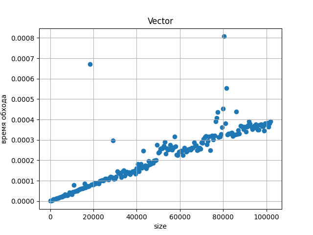
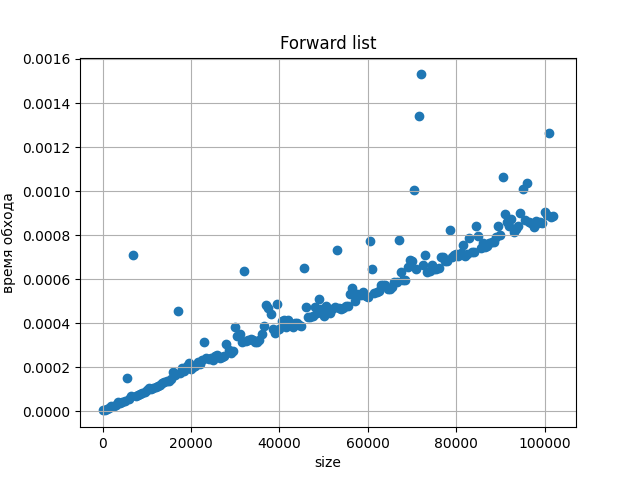
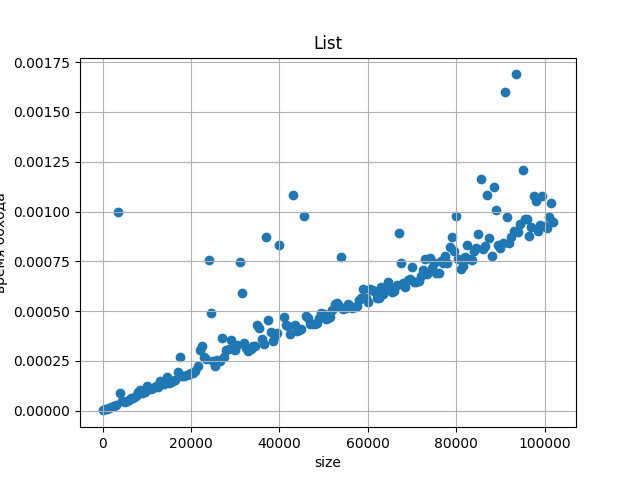
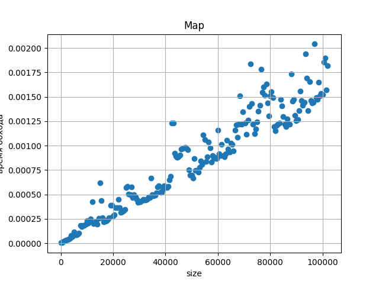
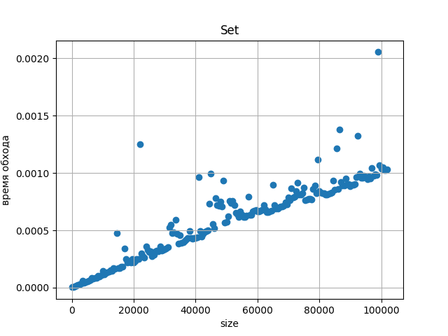

</details>
