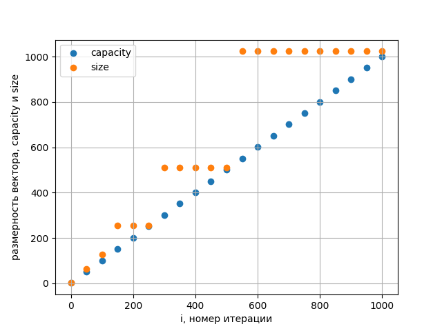
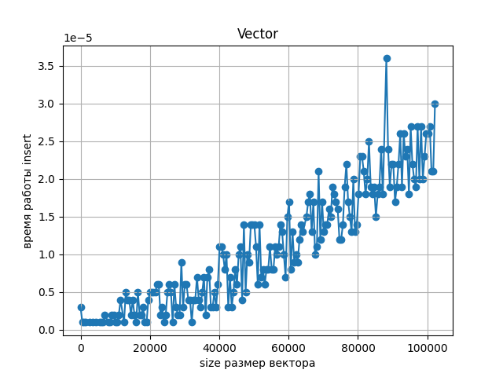
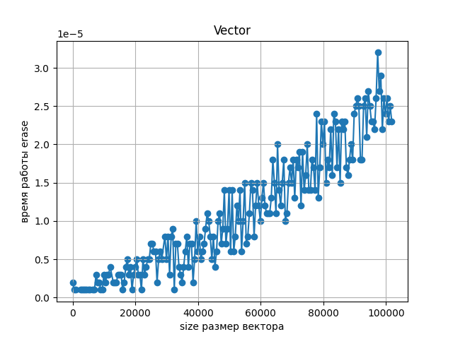
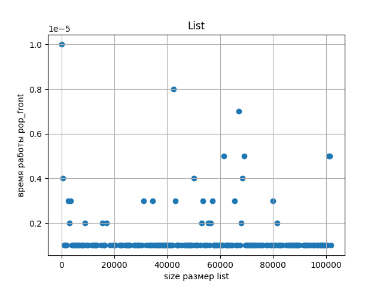
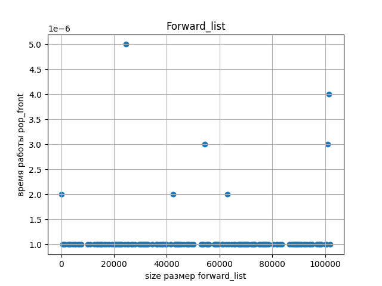

# Лаба по контейнерам
## 0. Пример с лекции - push_back для vector. График: capacity и size от i (номера итерации).
```C++
#include <iostream>
#include <fstream>
#include <vector>


int main() {
    std::vector<int> v;
    std::ofstream f("0.csv", std::ios::out);
    for (int i = 0; i < 1024; i++) {
        v.push_back(i);
        if (i % 50 == 0) {
            unsigned int cap = v.capacity();
            unsigned int s = v.size();
            f << i << " " << cap << " " << s << "\n";
        }
    }
}
```



## 1. Среднее время вставки элемента в произвольное место вектора. Реализуйте для своего контейнера insert, измерьте среднее время для различного размера контейнера (size) при вставке в произвольное место, сравните со стандартным контейнером. График: среднее время вставки для vector и subvector от size. Определить асимптотику.
для std::vector:
```C++
#include <iostream>
#include <fstream>
#include <vector>
#include <random>
#include <chrono>

double get_time() {
    return std::chrono::duration_cast<std::chrono::microseconds>
                   (std::chrono::steady_clock::now().time_since_epoch()).count() / 1e6;
}

int main() {
    std::vector<int> v;
    std::ofstream f("1_1.csv", std::ios::out);
    for (unsigned int i = 0; i < 102400; i++) {
        v.push_back(i);
        unsigned int x = rand() % (i + 1);
        if (i % 500 == 0) {
            auto start = get_time();
            v.insert(v.begin() + x, i);
            auto finish = get_time();
            auto time = finish - start;
            f << v.size() << " " << time << "\n";
        }
    }
}
```



## 2. Среднее время удаления одного элемента из произвольного места вектора. Реализуйте для своего контейнера erase, измерьте среднее время для различного размера контейнера (size) при вставке в произвольное место, сравните со стандартным контейнером. График: среднее время удаления для vector и subvector от size. Определить асимптотику.
для std::vector:
```C++
#include <iostream>
#include <fstream>
#include <vector>
#include <random>
#include <chrono>

double get_time() {
    return std::chrono::duration_cast<std::chrono::microseconds>
                   (std::chrono::steady_clock::now().time_since_epoch()).count() / 1e6;
}

int main() {
    std::vector<int> v;
    std::ofstream f("2_1.csv", std::ios::out);
    for (unsigned int i = 0; i < 102400; i++) {
        v.push_back(i);
        if (i % 500 == 0) {
            unsigned int x = rand() % (i + 1);
            auto start = get_time();
            v.erase(v.begin() + x);
            auto finish = get_time();
            auto time = finish - start;
            f << v.size() << " " << time << "\n";
        }
    }
}
```



## 3. Среднее время добавления в начало односвязного списка. График: среднее время работы push_front для list, forward_list и subforward_list от size. Определить асимптотику.
для std::list и std::forward_list: 
```C++
#include <fstream>
#include <random>
#include <chrono>
#include <list>
#include <forward_list>

double get_time() {
    return std::chrono::duration_cast<std::chrono::microseconds>
                   (std::chrono::steady_clock::now().time_since_epoch()).count() / 1e6;
}

int main() {
    std::list<int> l;
    std::forward_list<int> fl;
    std::ofstream f1("3_1.csv", std::ios::out);
    std::ofstream f2("3_2.csv", std::ios::out);
    for (unsigned int i = 0; i < 102400; i++) {

        if (i % 500 == 0) {
            auto start1 = get_time();
            l.push_front(i);
            auto finish1 = get_time();
            auto time1 = finish1 - start1;
            f1 << l.size() << " " << time1 << "\n";

            auto start2 = get_time();
            fl.push_front(i);
            auto finish2 = get_time();
            auto time2 = finish2 - start2;
            f2 << l.size() << " " << time2 << "\n";
            continue;
        }
        l.push_front(i);
        fl.push_front(i);
    }
}
```


## 4. Среднее время удаления из начала односвязного списка. График: среднее время работы pop_front для list, forward_list и subforward_list от size. Определить асимптотику.
для std::list и std::forward_list:
```C++
#include <fstream>
#include <random>
#include <chrono>
#include <list>
#include <forward_list>

double get_time() {
    return std::chrono::duration_cast<std::chrono::microseconds>
                   (std::chrono::steady_clock::now().time_since_epoch()).count() / 1e6;
}

int main() {
    std::list<int> l;
    std::forward_list<int> fl;
    std::ofstream f1("4_1.csv", std::ios::out);
    std::ofstream f2("4_2.csv", std::ios::out);
    for (unsigned int i = 0; i < 102400; i++) {
        l.push_front(i);
        fl.push_front(i);
        if (i % 500 == 0) {
            auto start1 = get_time();
            l.pop_front();
            auto finish1 = get_time();
            auto time1 = finish1 - start1;
            f1 << l.size() << " " << time1 << "\n";

            auto start2 = get_time();
            fl.pop_front();
            auto finish2 = get_time();
            auto time2 = finish2 - start2;
            f2 << l.size() << " " << time2 << "\n";
        }
    }
}
```


