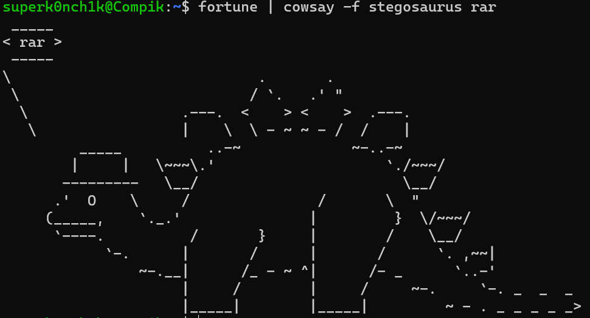
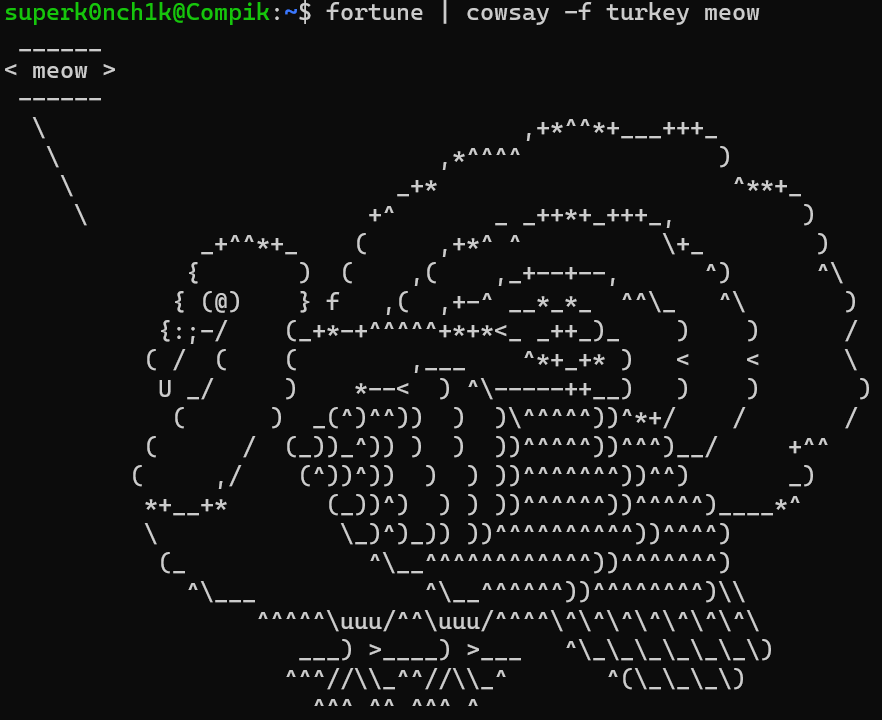
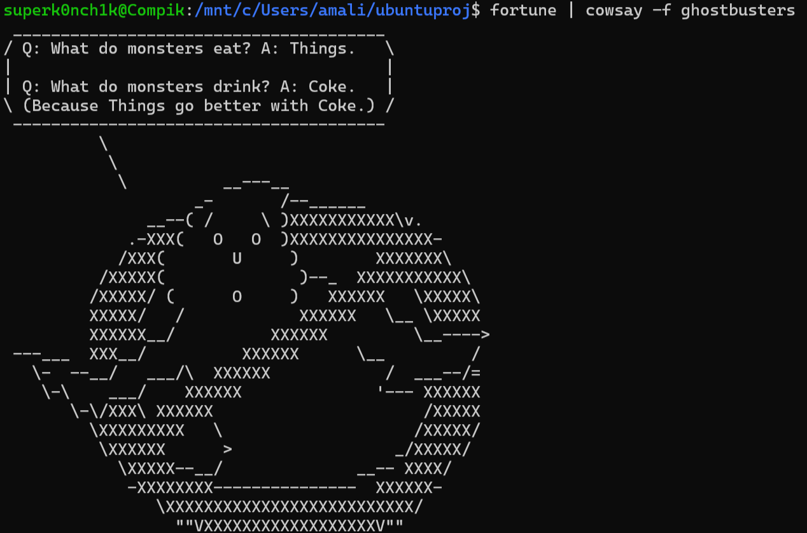
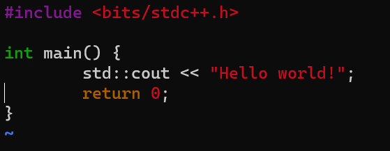
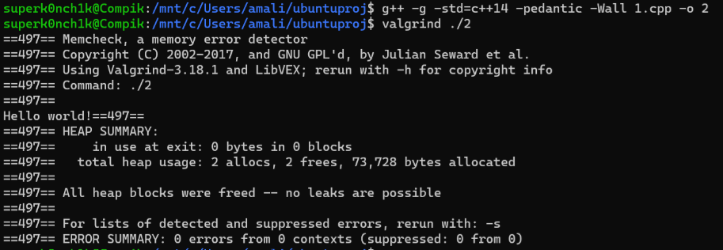
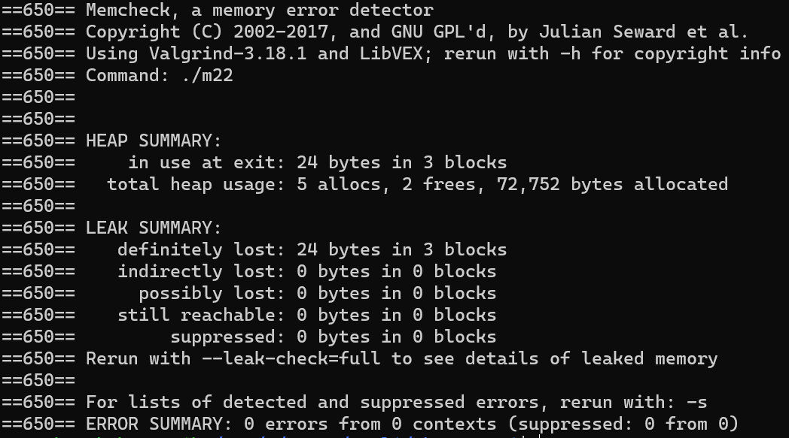
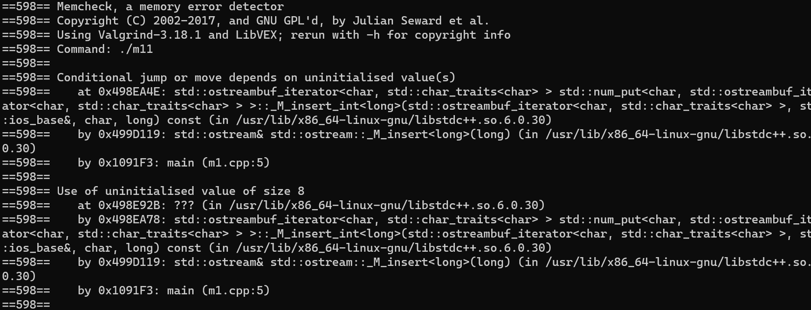
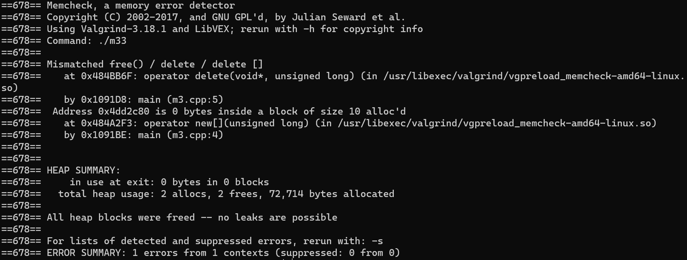

# Лабораторная 0
## Пакет cowsay








## Компилируем и запускаем валгриндом Hello world!

текстовый редактор vim: 



компилируем с помощью валгринд:



## Ошибки памяти

утечка памяти:

```C++
#include <bits/stdc++.h>

int main() {
	int **a;
	a = new int*[3];
	for (int i = 0; i < 3; i++)
		a[i]= new int[2];
	delete[] a;

}
```



использование неиницилизированных переменных:

```C++

#include <bits/stdc++.h>

int main() {
	int a[4] = {1, 2, 3, 4};
	std::cout << a[4];
}
```



промах(разыменование некорректного указателя):


несогласованный delete:

```C++
#include <bits/stdc++.h>

int main() {
	char *f = new char[10];
	delete f;
}
```


